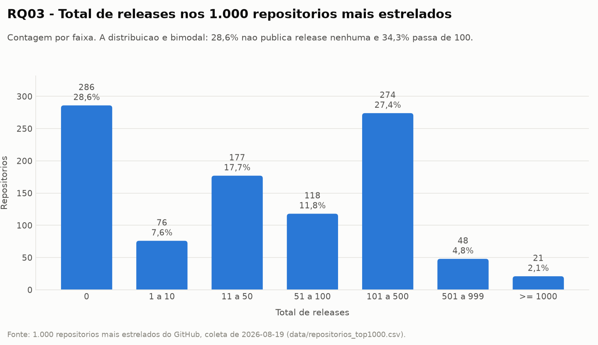
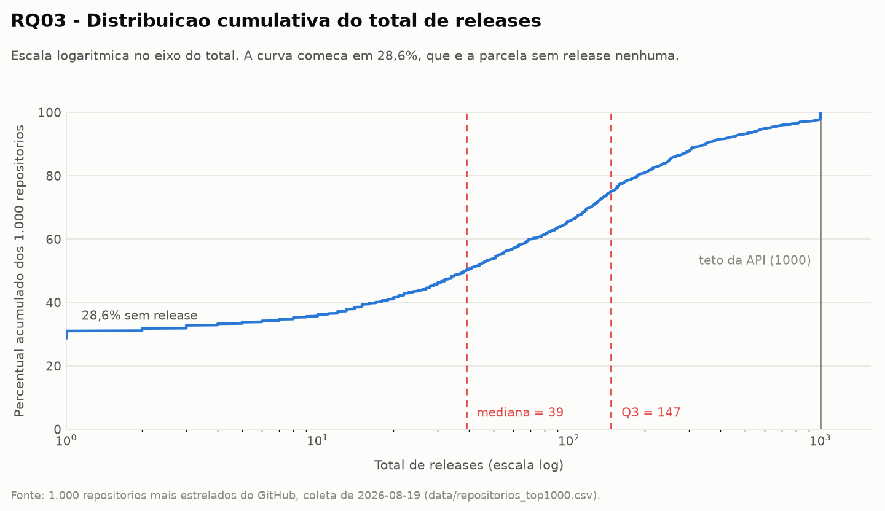
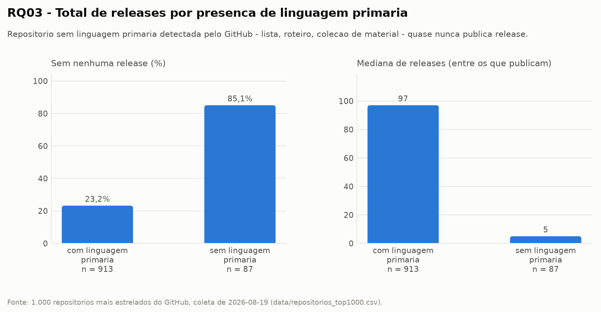
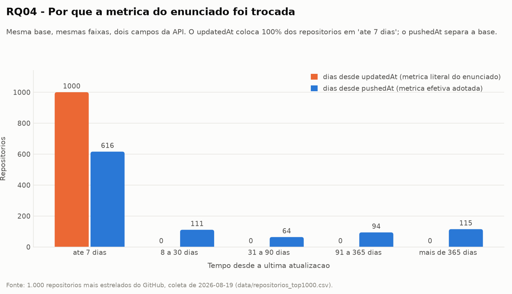
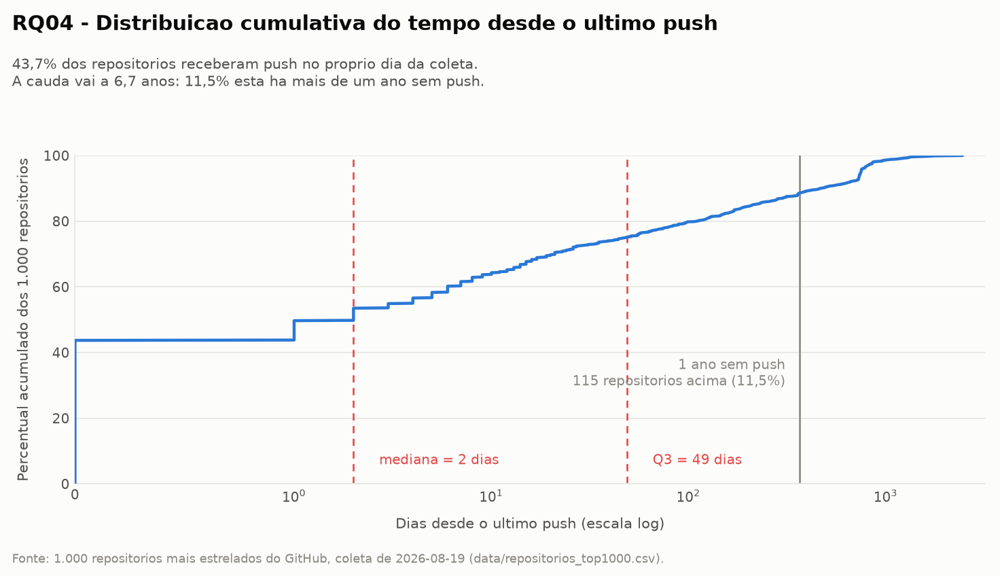
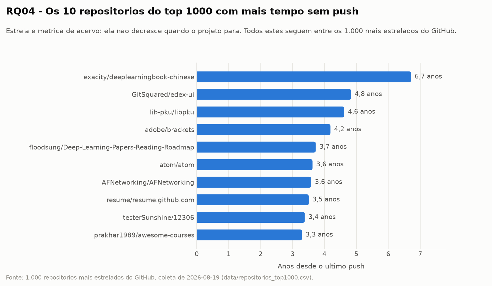
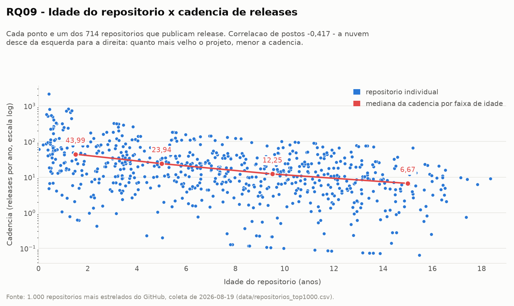
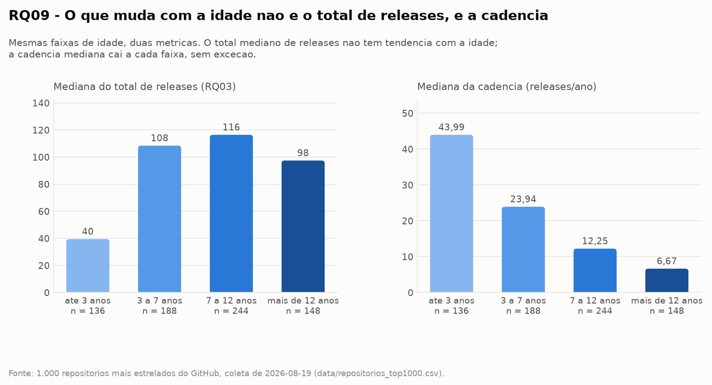
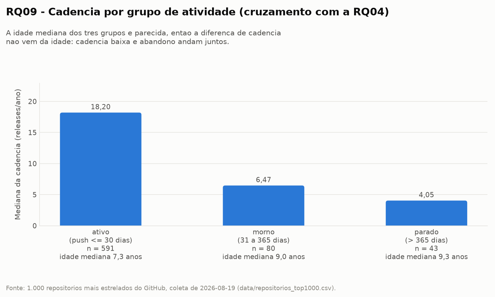

# Relatório Final — Laboratório 01: Características de repositórios populares

**Versão 2 (entrega da Lab01S03 + Relatório Final).** A versão 1, entregue na
Lab01S02, trouxe a introdução com as hipóteses informais, a metodologia de coleta
e a configuração do processo. Esta versão acrescenta a estrutura GQM
(objetivo → questão → métrica), os resultados consolidados e as visualizações das
7 RQs do enunciado mais as 2 propostas pelo grupo, e fecha a discussão hipótese
vs. resultado.

- **Repositório:** https://github.com/gabrieltinoco/Laboratorio-Experimentacao-de-Software
- **GitHub Projects (v2):** https://github.com/users/gabrieltinoco/projects/2
- **Integrantes:** Arthur Miranda Pacher (`art1544`), Gabriel Lage Silva (`gabitolage`), Gabriel Lucas Tinoco de Aguiar (`gabrieltinoco`)
- **Base analisada:** `data/repositorios_top1000.csv` — 1.000 repositórios, coleta de 2026-08-19.

---

## 1. Introdução e hipóteses informais

O objeto de estudo são os 1.000 repositórios com maior número de estrelas no
GitHub. A pergunta de fundo é se "popular" implica um conjunto de características
de engenharia — maturidade, contribuição externa, cadência de release,
manutenção ativa, escolha de linguagem e disciplina no tratamento de issues.

A hipótese geral do grupo é que **estrela mede acervo, não atividade**: o
contador de estrelas é cumulativo e nunca decresce, então o top 1000 tende a
reunir tanto projetos vivos quanto projetos que foram muito populares no passado.
Se isso for verdade, cada RQ deve mostrar uma distribuição com cauda longa, e a
mediana — não a média — é o valor central a reportar.

Uma segunda hipótese, que atravessa várias RQs, é que o top 1000 **não é
composto só de software**. Listas "awesome", roteiros de estudo e coleções de
material didático são extremamente estreladas sem serem software distribuível, e
isso deve distorcer qualquer métrica que pressuponha um ciclo de
desenvolvimento (releases, pull requests, linguagem primária).

As hipóteses específicas por RQ, cada uma registrada na Issue do integrante
responsável:

| RQ | Métrica | Hipótese informal | Responsável / Issue |
|---|---|---|---|
| RQ01 | Idade do repositório | Repositórios populares tendem a ser maduros: esperamos que a maioria tenha pelo menos 5 anos, embora exista uma cauda de projetos novos. | `gabrieltinoco` — [#5](https://github.com/gabrieltinoco/Laboratorio-Experimentacao-de-Software/issues/5) |
| RQ02 | Total de pull requests aceitas | Repositórios populares tendem a receber muita contribuição externa: esperamos mediana alta de PRs aceitas e a maioria com pelo menos 500 PRs. | `gabrieltinoco` — [#6](https://github.com/gabrieltinoco/Laboratorio-Experimentacao-de-Software/issues/6) |
| RQ03 | Total de releases | Sistemas populares lançam releases com frequência: mediana alta e pouquíssimos repositórios sem release. | `art1544` — [#7](https://github.com/gabrieltinoco/Laboratorio-Experimentacao-de-Software/issues/7) |
| RQ04 | Tempo até a última atualização | Sistemas populares são atualizados com frequência: tempo curto desde a última atualização para praticamente todos. | `art1544` — [#8](https://github.com/gabrieltinoco/Laboratorio-Experimentacao-de-Software/issues/8) |
| RQ05 | Linguagem primária | *a preencher* | `gabitolage` — [#9](https://github.com/gabrieltinoco/Laboratorio-Experimentacao-de-Software/issues/9) |
| RQ06 | Razão issues fechadas / total | *a preencher* | `gabitolage` — [#10](https://github.com/gabrieltinoco/Laboratorio-Experimentacao-de-Software/issues/10) |
| RQ07 | RQ02, RQ03 e RQ04 por linguagem | *a preencher* | `gabitolage` — [#11](https://github.com/gabrieltinoco/Laboratorio-Experimentacao-de-Software/issues/11) |
| RQ08 (proposta pelo grupo) | Licença SPDX | *a preencher* | `gabitolage` — [#13](https://github.com/gabrieltinoco/Laboratorio-Experimentacao-de-Software/issues/13) |
| RQ09 (proposta pelo grupo) | Cadência de releases (releases por ano de vida) | A cadência se mantém ao longo da vida do projeto, e o total de releases da RQ03 cresce com a idade. | `art1544` — [#18](https://github.com/gabrieltinoco/Laboratorio-Experimentacao-de-Software/issues/18) |

As RQ08 e RQ09 não estão no enunciado: são questões propostas pelo próprio
grupo, uma por integrante que as levantou, a partir do que a coleta permitiu
perguntar além das 7 originais.

### RQ03 — Sistemas populares lançam releases com frequência?

**Hipótese.** Um projeto com dezenas de milhares de estrelas tende a ser
consumido como dependência por terceiros, e quem é consumido como dependência
precisa de versionamento publicado. Esperamos, portanto, mediana de releases alta
e pouquíssimos repositórios sem nenhuma release.

### RQ04 — Sistemas populares são atualizados com frequência?

**Hipótese.** A visibilidade gera um fluxo constante de issues e pull requests, e
esse fluxo mantém o repositório em movimento. Esperamos tempo curto desde a
última atualização para praticamente todos os repositórios.

### RQ09 (proposta pelo grupo) — A cadência de releases se mantém ao longo da vida do projeto?

**Métrica.** Cadência de releases = `total_releases / idade em anos`, cruzada com
a idade do repositório (RQ01) e com o tempo desde o último push (RQ04).

**Por que perguntar isso.** A RQ03 mede o **total absoluto** de releases, e essa
métrica tem um viés estrutural: um repositório de 15 anos teve três vezes mais
tempo para publicar releases que um de 5 anos. Parte do resultado da RQ03 pode
ser, então, idade disfarçada de cadência. Normalizar pela idade testa se a
resposta da RQ03 sobrevive, e amarra três RQs que seriam respondidas
isoladamente: idade (RQ01), releases (RQ03) e atividade (RQ04).

**Hipótese.** Esperamos duas coisas. Primeira: que o total de releases cresça com
a idade, porque projeto mais velho teve mais tempo de publicar. Segunda: que a
cadência, uma vez normalizada, seja aproximadamente estável entre projetos novos
e antigos, porque a prática de versionar releases seria uma característica do
projeto, não da época em que ele nasceu.

---

## 2. Objetivos, questões e métricas (GQM)

Esta seção formaliza o que as RQs do enunciado descrevem em texto corrido, no
formato **GQM (Goal–Question–Metric)**: cada objetivo de medição se desdobra em
questões, e cada questão em métricas com definição operacional e evidência
rastreável. A tabela serve como índice de auditoria do laboratório — para
qualquer número deste relatório é possível chegar ao campo da API, à coluna do
CSV, ao script que o calcula e à figura que o mostra.

### 2.1 Objetivos de medição

Os objetivos seguem o gabarito GQM: *analisar `<objeto>` com o propósito de
`<propósito>` com respeito a `<foco de qualidade>` do ponto de vista de
`<perspectiva>` no contexto de `<contexto>`.* O objeto, a perspectiva e o
contexto são os mesmos nos três; o que muda é o foco de qualidade.

| ID | Objetivo de medição | RQs |
|---|---|---|
| **O1** | Analisar **os 1.000 repositórios mais estrelados do GitHub** com o propósito de **caracterizá-los** com respeito à **maturidade do projeto e ao volume de contribuição externa recebida**, do ponto de vista de **quem avalia adotar um projeto open-source como dependência**, no contexto do **ecossistema open-source público do GitHub em 2026**. | RQ01, RQ02 |
| **O2** | Mesmo objeto, propósito, perspectiva e contexto, com respeito à **disciplina de versionamento e à manutenção ativa do código**. | RQ03, RQ04, RQ09 |
| **O3** | Mesmo objeto, propósito, perspectiva e contexto, com respeito às **escolhas tecnológicas e à gestão da demanda registrada** (linguagem, issues e licença). | RQ05, RQ06, RQ07, RQ08 |

A escolha da perspectiva não é decorativa: é ela que justifica reportar **mediana
em vez de média** em todas as RQs. Quem avalia adotar uma dependência quer saber
como é o projeto típico da população, e não o valor inflado por um punhado de
outliers extremos.

### 2.2 Questões e métricas

`n` é o número de repositórios que entram em cada métrica. Quando `n < 1000`, a
coluna explica a exclusão — nenhuma linha foi removida do CSV.

| Objetivo | RQ | Questão | Métrica | Operacionalização (campo GraphQL → coluna do CSV) | Estatística reportada | n | Evidência |
|---|---|---|---|---|---|---|---|
| O1 | **RQ01** | Sistemas populares são maduros/antigos? | Idade do repositório, em anos | `createdAt` → `created_at`; idade = (data da coleta − `created_at`) / 365,25 | Mediana, média, Q1/Q3, faixas de idade, outliers de Tukey | 1.000 | `src/rq01_rq02.py` · § 4.1 |
| O1 | **RQ02** | Sistemas populares recebem muita contribuição externa? | Total de pull requests aceitas | `pullRequests(states: MERGED).totalCount` → `pull_requests_aceitas` | Mediana, média, Q1/Q3, faixas, outliers de Tukey | 1.000 | `src/rq01_rq02.py` · § 4.2 |
| O2 | **RQ03** | Sistemas populares lançam releases com frequência? | Total de releases | `releases.totalCount` → `total_releases` | Mediana, média, Q1/Q3, contagem por faixa, outliers de Tukey, saturação no teto da API | 1.000 | `src/analise_rq03.py` · § 4.3 · Fig. 1–3 |
| O2 | **RQ04** | Sistemas populares são atualizados com frequência? | *Métrica do enunciado:* dias desde a última atualização | `updatedAt` → `ultima_atualizacao`, `dias_desde_ultima_atualizacao` | Mediana, Q1/Q3, amplitude, % saturado em 0 dia | 1.000 | `src/analise_rq04.py` · § 4.4 · Fig. 4 |
| O2 | **RQ04** | *(idem)* | *Métrica efetiva adotada:* dias desde o último push de código | `pushedAt` → `ultimo_push`, `dias_desde_ultimo_push` | Mediana, média, Q1/Q3, contagem por faixa, outliers de Tukey | 1.000 | `src/analise_rq04.py` · § 4.4 · Fig. 4–6 |
| O3 | **RQ05** | Sistemas populares são escritos nas linguagens mais populares? | Linguagem primária | `primaryLanguage.name` → `linguagem_primaria` (`"Nao informada"` quando nula) | Contagem e percentual por linguagem; % nas 5 linguagens do Octoverse 2025 | 1.000 | `src/validate_sample.py` · § 4.5 |
| O3 | **RQ06** | Sistemas populares possuem um alto percentual de issues fechadas? | Razão issues fechadas / issues totais | `issues.totalCount` e `issues(states: CLOSED).totalCount` → `issues_total`, `issues_fechadas`, `percentual_issues_fechadas` | Mediana, média, Q1/Q3, faixas de percentual | ≤ 1.000 (razão indefinida para repositório sem issue) | `src/validate_sample.py` · § 4.6 |
| O3 | **RQ07** | Sistemas em linguagens mais populares recebem mais contribuição, lançam mais releases e são atualizados com mais frequência? | RQ02, RQ03 e RQ04 estratificadas por `linguagem_primaria` | As mesmas três colunas, agrupadas por linguagem | Mediana por linguagem das três métricas | 1.000 | `src/validate_sample.py` · § 4.7 |
| O3 | **RQ08** *(grupo)* | A licença afeta popularidade e contribuição? | Identificador de licença SPDX | `licenseInfo.spdxId` → `licenca` (`"Sem licenca"` quando nula) | Mediana de estrelas e de PRs aceitas por licença | 1.000 | `src/validate_sample.py` · § 4.8 |
| O2 | **RQ09** *(grupo)* | A cadência de releases se mantém ao longo da vida do projeto? | Cadência = `total_releases` / idade em anos | Derivada de `total_releases` e `created_at`; nenhum campo novo na consulta | Mediana, média, Q1/Q3; correlação de postos idade × cadência e idade × total de releases; medianas por faixa de idade e por grupo de atividade | 714 (os 286 sem release têm cadência **indefinida**, não zero) | `src/analise_rq09.py` · § 4.9 · Fig. 7–9 |

### 2.3 Decisões de medição que precisam ficar registradas

Três métricas não puderam ser usadas na forma literal do enunciado. Cada
substituição está justificada por evidência na própria base, e não por
conveniência:

| # | Métrica no enunciado | Problema constatado | Decisão | Evidência |
|---|---|---|---|---|
| 1 | RQ04: "tempo até a última atualização" (`updatedAt`) | O campo sobe a cada estrela, watch ou fork, não só com mudança de código. Nesta população fica saturado: 984 de 1.000 (98,4%) marcam 0 dia e a amplitude total é de 0 a 2 dias. | Reportar `updatedAt` para cumprir a métrica literal **e** adotar `pushedAt` como métrica efetiva, que varia de 0 a 2.451 dias. | Fig. 4 · § 4.4 |
| 2 | RQ03: "total de releases" | `releases.totalCount` satura em 1.000. 21 repositórios (2,1%) marcam exatamente 1.000. | Manter o valor e tratá-lo como **limite inferior** (`>= 1000`), sinalizado em toda figura e tabela da RQ03 e da RQ09. | Fig. 2 · § 4.3 |
| 3 | RQ09: cadência para repositório sem release | `0 releases / idade` daria cadência zero, misturando "não versiona" com "versiona pouco". | Cadência **indefinida** para os 286 sem release, que são analisados como grupo próprio. | § 4.9 |

### 2.4 Estatísticas e critérios usados

Para que todas as RQs sejam comparáveis, as mesmas convenções valem em todo o
relatório:

| Convenção | Definição | Por quê |
|---|---|---|
| Valor central | **Mediana** | Todas as métricas têm cauda longa à direita; a média é arrastada pelos outliers e não descreve o projeto típico. |
| Dispersão | Q1, Q3 e IQR = Q3 − Q1 | Robustos a outlier, ao contrário do desvio padrão. |
| Outlier | Critério de **Tukey**: fora de [Q1 − 1,5·IQR, Q3 + 1,5·IQR] | Critério único e explícito para as 9 RQs; nenhum outlier é removido da base. |
| Associação entre duas métricas | **Correlação de postos (Spearman)**, calculada no próprio script | As variáveis têm outliers extremos que dominariam uma correlação linear; a de postos usa a ordem, não o valor. |
| Ruído da correlação | \|ρ\| > 1,96 / √(n − 1) | Diz se a correlação encontrada é grande o bastante para o tamanho da amostra, sem depender de biblioteca de estatística. |
| Data de referência | 2026-08-19T15:14:50Z, o instante da coleta, **reconstruído do próprio CSV** | Fixa a idade e os prazos: rodar a análise hoje ou em um ano dá o mesmo número. Ver § 3.6. |

---

## 3. Metodologia de coleta

### 3.1 Fonte e recorte

Os dados vêm da **API GraphQL v4 do GitHub**, consultada por script próprio do
grupo (`Laboratorio01/src/fetch_repos.py`). Não é usada nenhuma biblioteca de
terceiros que consulte a API do GitHub: a query é escrita à mão e enviada por
requisição HTTP direta.

O recorte é a busca `stars:>1 sort:stars-desc` no tipo `REPOSITORY`, tomando os
**1.000 primeiros resultados** — que é também o teto de resultados que o endpoint
`search` devolve para uma mesma query.

### 3.2 Paginação

A busca é paginada por cursor, usando `pageInfo.hasNextPage` e
`pageInfo.endCursor` do próprio `search`, com o cursor da página anterior sendo
passado no argumento `after` da requisição seguinte. O laço para quando 1.000
repositórios foram coletados ou quando a API sinaliza que não há próxima página.
Respostas com erro 5xx são repetidas com espera progressiva.

### 3.3 Campos coletados

Uma única query traz todos os campos necessários a todas as RQs, para não haver
risco de o mesmo repositório ser lido em momentos diferentes:

| Campo GraphQL | Coluna no CSV | RQ |
|---|---|---|
| `nameWithOwner` | `repositorio` | identificação |
| `stargazerCount` | `estrelas` | recorte e RQ08 |
| `createdAt` | `created_at` | RQ01, RQ09 |
| `pullRequests(states: MERGED).totalCount` | `pull_requests_aceitas` | RQ02, RQ07 |
| `releases.totalCount` | `total_releases` | RQ03, RQ07, RQ09 |
| `updatedAt` | `ultima_atualizacao`, `dias_desde_ultima_atualizacao` | RQ04, RQ07 |
| `pushedAt` | `ultimo_push`, `dias_desde_ultimo_push` | RQ04, RQ07 |
| `primaryLanguage.name` | `linguagem_primaria` | RQ05, RQ07 |
| `issues.totalCount` | `issues_total` | RQ06 |
| `issues(states: CLOSED).totalCount` | `issues_fechadas`, `percentual_issues_fechadas` | RQ06 |
| `licenseInfo.spdxId` | `licenca` | RQ08 |

As colunas derivadas (`dias_desde_*`, `percentual_issues_fechadas`) são
calculadas no momento da coleta, a partir dos campos brutos, e os campos brutos
são preservados no CSV para permitir recálculo e auditoria.

Saída: `Laboratorio01/data/repositorios_top1000.csv`, uma linha por repositório.

### 3.4 Definição de "linguagens mais populares" (RQ05 e RQ07)

A referência adotada é o **GitHub Octoverse 2025**, e é a mesma em todo o
laboratório: TypeScript, Python, JavaScript, Java e C#. A lista está fixada em
`src/validate_sample.py` (constante `LINGUAGENS_POPULARES`), para que a RQ05 e a
RQ07 usem exatamente o mesmo conjunto.

### 3.5 Scripts de validação e de análise

Cada integrante valida e analisa a sua parte das RQs em script próprio. Os
scripts de validação (S02) verificam consistência estrutural campo a campo,
distribuição, outliers e valores ausentes; os de análise (S03) consolidam os
resultados e geram as figuras.

| Script | Sprint | Cobertura |
|---|---|---|
| `src/fetch_repos.py` | S01/S02 | Coleta paginada dos 1.000 repositórios |
| `src/rq01_rq02.py` | S02/S03 | RQ01, RQ02 |
| `src/validate_sample_rq03_rq04.py` | S02 | Validação de consistência das RQ03 e RQ04 |
| `src/validate_sample.py` | S02/S03 | RQ05, RQ06, RQ07, RQ08 |
| `src/rq09_cadencia_releases.py` | S02 | Validação e resultado numérico da RQ09 |
| **`src/analise_base.py`** | **S03** | **Base comum: carga do CSV, estatística e estilo dos gráficos** |
| **`src/analise_rq03.py`** | **S03** | **Análise e visualização da RQ03** |
| **`src/analise_rq04.py`** | **S03** | **Análise e visualização da RQ04** |
| **`src/analise_rq09.py`** | **S03** | **Análise e visualização da RQ09** |
| `src/export_project_snapshot.py` | todas | Snapshot de fechamento de sprint do GitHub Projects |

A estatística é toda calculada nos scripts do grupo — mediana, quartis, cercas de
Tukey, distribuição cumulativa empírica e correlação de postos de Spearman. A
única dependência externa da análise é o `matplotlib`, e ela é usada apenas para
desenhar.

### 3.6 Reprodutibilidade da análise

A idade do repositório não está no CSV: precisa ser derivada de `created_at`. Se
fosse derivada de `datetime.now()`, ela cresceria a cada execução e os números
deste relatório deixariam de ser verificáveis.

Por isso a **data de referência é reconstruída a partir do próprio CSV**, somando
`ultima_atualizacao` com `dias_desde_ultima_atualizacao` e tomando o máximo entre
as 1.000 linhas — o que devolve o instante da coleta, `2026-08-19T15:14:50Z`.
Toda a seção 4 usa essa referência, e rodar os scripts em qualquer data futura
reproduz exatamente os mesmos valores. O procedimento completo de reprodução está
em [`REPRODUCAO.md`](REPRODUCAO.md).

### 3.7 Limitações conhecidas da coleta

- **`releases.totalCount` satura em 1.000.** 21 repositórios do top 1000 marcam
  exatamente 1.000 releases; nesses casos o valor é um limite inferior, não a
  contagem real.
- **`updatedAt` não mede atividade de código.** O campo sobe a cada estrela ou
  watch recebido. Nesta população ele fica saturado (detalhado na RQ04).
- **A coleta não é atômica.** As 1.000 linhas são lidas ao longo de várias
  requisições, então um repositório que recebe push durante a coleta pode ficar
  com contagem de dias negativa por questão de minutos. Ocorreu em 1 caso.
- **`pullRequests(states: MERGED)` conta PR aceita de qualquer autor**, inclusive
  de mantenedores. É uma aproximação de "contribuição externa", não a medida
  exata.
- **O ranking por estrelas é uma fotografia** e muda com o tempo. O CSV
  versionado é o dado da entrega; `fetch_repos.py` não deve ser reexecutado para
  reproduzir esta análise.

---

## 4. Resultados por RQ

### 4.1 RQ01 — Idade do repositório

Não foram encontrados valores ausentes ou inválidos em `created_at` (0/1000). A idade mediana foi de **7,75 anos**, com média de 7,67, mínimo de 0,02 e máximo de 18,36 anos. Em relação à distribuição, 323 repositórios (32,3%) têm menos de 5 anos, 331 (33,1%) têm entre 5 e 10 anos e 346 (34,6%) têm 10 anos ou mais. Ao todo, 677 (67,7%) têm pelo menos 5 anos.

Pelo critério de Tukey, usando 1,5 x IQR, Q1 = 3,52 e Q3 = 11,36 anos, não foram identificados outliers. O resultado apoia a hipótese informal de maturidade para a maioria, mas a presença de 323 repositórios com menos de 5 anos impede tratá-la como universal.

### 4.2 RQ02 — Total de pull requests aceitas

Não foram encontrados valores ausentes ou inválidos em `pull_requests_aceitas` (0/1000). A mediana foi de **768 PRs aceitas**, com média de 4.237,1, mínimo de 0 e máximo de 103.354. A distribuição foi: 20 repositórios (2,0%) com 0 PR, 396 (39,6%) entre 1 e 499, 398 (39,8%) entre 500 e 4.999 e 186 (18,6%) com 5.000 ou mais. Ao todo, 584 (58,4%) têm pelo menos 500 PRs aceitas.

A distribuição é fortemente assimétrica à direita: Q1 = 175, Q3 = 3416 e IQR = 3241. Pelo critério de Tukey, os valores acima de 8277 são outliers; foram identificados 124 (12,4%), incluindo `firstcontributions/first-contributions`, `llvm/llvm-project`, `elastic/elasticsearch`, `getsentry/sentry` e `home-assistant/core`. Esses valores não devem ser removidos, mas a mediana deve ser priorizada na interpretação. A mediana alta e 58,4% acima do corte apoiam a hipótese informal, enquanto a cauda extrema explica por que a média não é representativa.

### 4.3 RQ03 — Total de releases

*Métrica: `releases.totalCount` → `total_releases`. Script:
[`src/analise_rq03.py`](src/analise_rq03.py). Nenhum valor ausente ou
inconsistente em 1.000 repositórios.*

**Valores centrais.**

| Estatística | Valor |
|---|---:|
| n | 1.000 |
| **Mediana** | **39 releases** |
| Média | 126,6 |
| Q1 / Q3 | 0 / 147 |
| IQR | 147 |
| Mínimo / máximo | 0 / 1.000 |
| Cerca superior de Tukey (Q3 + 1,5·IQR) | 368 |
| Outliers superiores | 93 (9,3%) |

A média de 126,6 é mais de três vezes a mediana e o primeiro quartil é **zero**:
a média não descreve nada nesta distribuição. A mediana de 39 é o único valor
central defensável.

**Contagem por categoria.**

| Faixa de total de releases | Repositórios | % |
|---|---:|---:|
| 0 (nenhuma release) | 286 | 28,6% |
| 1 a 10 | 76 | 7,6% |
| 11 a 50 | 177 | 17,7% |
| 51 a 100 | 118 | 11,8% |
| 101 a 500 | 274 | 27,4% |
| 501 a 999 | 48 | 4,8% |
| >= 1.000 (teto da API) | 21 | 2,1% |

**Figura 1 — RQ03: contagem por faixa de total de releases.** A distribuição é
**bimodal**: um bloco de 28,6% sem release nenhuma e um bloco de 34,3% acima de
100, com pouca massa no meio. Um único valor agregado não representa nem um dos
dois blocos.

**Figura 2 — RQ03: distribuição cumulativa (ECDF) em escala logarítmica.** A
curva parte de 28,6%, que é a parcela sem release, e sobe suavemente até o teto
de 1.000 da API. Q1 = 0 não aparece na escala log justamente porque um quarto da
base está em zero.

**O teto da API.** 21 repositórios (2,1%) marcam exatamente 1.000 releases —
entre eles `langchain-ai/langchain`, `vercel/next.js`, `ggml-org/llama.cpp`,
`electron/electron` e `storybookjs/storybook`. Para todos eles o valor é um
limite inferior (`>= 1000`), não a contagem real.

**Software distribuível x coleção de material.** A ausência de
`primaryLanguage` é o proxy disponível no CSV para "repositório que não é
software distribuível": lista, roteiro de estudo, coleção de material. O corte
separa duas populações muito diferentes:

| Grupo | n | Sem nenhuma release | Mediana de releases (entre os que publicam) |
|---|---:|---:|---:|
| Com linguagem primária | 913 | 212 (23,2%) | 97 |
| Sem linguagem primária | 87 | 74 (**85,1%**) | 5 |

**Figura 3 — RQ03: releases por presença de linguagem primária.** Entre os
repositórios que têm código, 76,8% publicam release. Entre os que não têm,
apenas 14,9%. **A RQ03 não deve ser respondida com um número agregado:** o
28,6% sem release não é falta de disciplina de versionamento, é presença de
repositórios que não são software.

### 4.4 RQ04 — Tempo até a última atualização

*Métrica do enunciado: `updatedAt`. Métrica efetiva adotada: `pushedAt`. Script:
[`src/analise_rq04.py`](src/analise_rq04.py). Nenhum valor ausente ou
inconsistente nas quatro colunas envolvidas.*

**A métrica literal do enunciado não discrimina nesta população.**

| Coluna | Mediana | Q1 | Q3 | Mínimo | Máximo |
|---|---:|---:|---:|---:|---:|
| Dias desde `updatedAt` (enunciado) | 0 | 0 | 0 | 0 | **2** |
| Dias desde `pushedAt` (efetiva) | 2 | 0 | 49 | −1 | **2.451** |

984 dos 1.000 repositórios (98,4%) marcam 0 dia desde `updatedAt`, e a amplitude
inteira do campo é de 2 dias. A causa é conhecida: o `updatedAt` sobe a cada
estrela, watch, fork ou edição de descrição, e os repositórios mais estrelados do
GitHub recebem estrelas continuamente. O `pushedAt`, que só sobe com push de
código, varia mais de 6 anos na mesma base.

**Figura 4 — RQ04: as duas métricas, mesma base e mesmas faixas.** O `updatedAt`
coloca 100% dos repositórios na primeira faixa e deixa as outras quatro vazias.
Reportar a mediana de 0 dia como resposta da RQ04 seria reportar um artefato da
API, e não uma característica dos sistemas estudados. **Daqui em diante a RQ04 é
respondida pelo `pushedAt`.**

**Valores centrais do `pushedAt`.**

| Estatística | Valor |
|---|---:|
| n | 1.000 |
| **Mediana** | **2 dias** |
| Média | 113,5 |
| Q1 / Q3 | 0 / 49 |
| IQR | 49 |
| Mínimo / máximo | −1 / 2.451 |
| Cerca superior de Tukey (Q3 + 1,5·IQR) | 122 |
| Outliers superiores | 195 (19,5%) |

O mínimo de −1 é o caso documentado de push ocorrido durante a coleta (§ 3.7);
é artefato de coleta, não dado inválido.

**Contagem por categoria.**

| Faixa desde o último push | Repositórios | % |
|---|---:|---:|
| Até 7 dias | 616 | 61,6% |
| 8 a 30 dias | 111 | 11,1% |
| 31 a 90 dias | 64 | 6,4% |
| 91 a 365 dias | 94 | 9,4% |
| Mais de 365 dias | **115** | **11,5%** |

Ao todo, 727 repositórios (72,7%) receberam push nos últimos 30 dias.

**Figura 5 — RQ04: distribuição cumulativa do tempo desde o último push.** 43,7%
recebeu push no próprio dia da coleta e a mediana é de 2 dias, mas a curva não
fecha: 11,5% está há mais de um ano sem uma linha de código nova.

**Figura 6 — RQ04: os 10 repositórios do top 1000 com mais tempo sem push.**
`exacity/deeplearningbook-chinese` está há 6,7 anos sem push e mantém 37.362
estrelas; `adobe/brackets`, um editor oficialmente descontinuado, está há 4,2
anos e mantém 33.013. São listas, roteiros de estudo e software descontinuado que
seguem no top 1000 por estrela acumulada — a estrela nunca decresce, o código
para.

### 4.5 RQ05 — Linguagem primária

*A preencher — [#9](https://github.com/gabrieltinoco/Laboratorio-Experimentacao-de-Software/issues/9), `gabitolage`.*

### 4.6 RQ06 — Percentual de issues fechadas

*A preencher — [#10](https://github.com/gabrieltinoco/Laboratorio-Experimentacao-de-Software/issues/10), `gabitolage`.*

### 4.7 RQ07 — RQ02, RQ03 e RQ04 por linguagem

*A preencher — [#11](https://github.com/gabrieltinoco/Laboratorio-Experimentacao-de-Software/issues/11), `gabitolage`.*

### 4.8 RQ08 (proposta pelo grupo) — Licença e popularidade/contribuição

*A preencher — [#13](https://github.com/gabrieltinoco/Laboratorio-Experimentacao-de-Software/issues/13), `gabitolage`.*

### 4.9 RQ09 (proposta pelo grupo) — Cadência de releases

*Métrica: cadência = `total_releases` / idade em anos. Scripts:
[`src/rq09_cadencia_releases.py`](src/rq09_cadencia_releases.py) (resultado
numérico, S02) e [`src/analise_rq09.py`](src/analise_rq09.py) (consolidação e
figuras, S03).*

Dos 1.000 repositórios, **714 (71,4%) têm cadência calculável**; os outros 286
não têm release nenhuma e, portanto, não têm cadência definida — o script trata
esse caso como ausência de versionamento, e não como cadência zero.

| Estatística da cadência (n = 714) | Valor |
|---|---:|
| **Mediana** | **14,91 releases/ano** |
| Média | 44,53 |
| Q1 / Q3 | 5,05 / 38,91 |
| Mínimo / máximo | 0,06 / 2.196,21 |

**A idade não explica o total de releases.** Correlação de postos (Spearman,
calculada no próprio script, sem biblioteca externa):

| Par de variáveis | ρ | n | Limite de ruído | Variação explicada (ρ²) |
|---|---:|---:|---:|---:|
| Idade × total de releases | **+0,062** | 1.000 | ±0,062 | 0,4% |
| Idade × cadência de releases | **−0,417** | 714 | ±0,073 | 17,4% |

O primeiro valor cai praticamente sobre o limite de ruído e, mesmo que fosse
real, explicaria 0,4% da variação: **repositório mais velho não tem mais
releases**. O segundo é quase seis vezes o limite, e no sentido oposto ao
esperado: **a cadência cai conforme o projeto envelhece.**

O resultado sobrevive aos dois testes de robustez: excluindo os repositórios com
menos de 1 ano de vida, onde dividir por uma fração de ano infla a cadência, a
correlação vai a −0,348 (n = 656); excluindo também os 21 que estão no teto de
1.000 releases da API, vai a −0,353 (n = 635). Sinal e ordem de grandeza se
mantêm.

**Figura 7 — RQ09: idade do repositório × cadência de releases (escala log).**
Cada ponto é um dos 714 repositórios que publicam release; a linha vermelha liga
a mediana da cadência de cada faixa de idade. A nuvem desce da esquerda para a
direita ao longo de toda a faixa de idades.

**Cadência por faixa de idade — o resultado central da RQ09:**

| Faixa de idade | n | Mediana de releases | Mediana de cadência |
|---|---:|---:|---:|
| Até 3 anos | 136 | 40 | **43,99 rel/ano** |
| 3 a 7 anos | 188 | 108 | 23,94 rel/ano |
| 7 a 12 anos | 244 | 116 | 12,25 rel/ano |
| Mais de 12 anos | 148 | 98 | **6,67 rel/ano** |

**Figura 8 — RQ09: total de releases e cadência, pelas mesmas faixas de idade.**
O total mediano de releases não tem tendência com a idade — sobe da primeira para
a terceira faixa e volta a cair na quarta. A cadência mediana, ao contrário, cai
em **todas** as faixas, por um fator de 6,6 entre a mais nova e a mais velha.

**Cadência por grupo de atividade (cruzamento com a RQ04):**

| Grupo | n | Mediana de cadência | Idade mediana |
|---|---:|---:|---:|
| Ativo (push ≤ 30 dias) | 591 | 18,20 rel/ano | 7,3 anos |
| Morno (31 a 365 dias) | 80 | 6,47 rel/ano | 9,0 anos |
| Parado (> 365 dias) | 43 | 4,05 rel/ano | 9,3 anos |

**Figura 9 — RQ09: cadência por grupo de atividade da RQ04.** A idade mediana dos
três grupos é próxima (7,3, 9,0 e 9,3 anos), então a diferença de cadência não
vem de idade: quem está parado hoje publicava release quatro vezes menos ao longo
de toda a sua vida.

**Os 286 sem release.** Idade mediana de 8,2 anos, mediana de 42 dias sem push, e
**56,3% recebeu push nos últimos 90 dias**. Um quarto deles (74, ou 25,9%) não
tem linguagem primária. Não são projetos mortos: são repositórios mantidos que
simplesmente não versionam releases — listas, roteiros de estudo e coleções de
material.

**Extremos.** No topo, `stablyai/orca` (2.196 rel/ano — 932 releases em 5 meses),
`ruvnet/ruflo` (826), `heygen-com/hyperframes` (796) e `openai/codex` (738):
todos projetos recentes, quase todos de ferramental de IA. Na base,
`moment/moment` (0,06 — uma release em 15,5 anos),
`DefinitelyTyped/DefinitelyTyped` (0,07) e `discourse/discourse` (0,07).

---

## 5. Discussão: hipótese vs. resultado

| RQ | Hipótese | Veredito | Resumo |
|---|---|---|---|
| RQ01 | A maioria é madura (≥ 5 anos) | **Confirmada em parte** | 67,7% tem ≥ 5 anos, mas 32,3% tem menos — maturidade não é universal. |
| RQ02 | Mediana alta de PRs aceitas | **Confirmada** | Mediana de 768; 58,4% acima de 500. A cauda extrema torna a média inútil. |
| RQ03 | Mediana alta e quase ninguém sem release | **Parcialmente refutada** | Mediana de 39 e 34,3% acima de 100 releases, mas 28,6% não publica release nenhuma. |
| RQ04 | Tempo curto para praticamente todos | **Confirmada para a maioria, com correção de método** | 61,6% com push na última semana, mas 11,5% parado há mais de um ano; a métrica literal teve de ser substituída. |
| RQ05 | *a preencher* | — | — |
| RQ06 | *a preencher* | — | — |
| RQ07 | *a preencher* | — | — |
| RQ08 | *a preencher* | — | — |
| RQ09 | O total cresce com a idade **e** a cadência é estável | **Refutada nas duas partes** | ρ(idade, total) = +0,062 (ruído); ρ(idade, cadência) = −0,417 — a cadência cai por um fator de 6,6. |

### RQ03 — parcialmente refutada

Entre os repositórios que de fato são software distribuível, a hipótese se
sustenta com folga: 76,8% dos 913 com linguagem primária publicam release, e
34,3% do top 1000 passa de 100 releases. Mas quase um terço da base (28,6%) não
publica release nenhuma, e a Figura 3 mostra de onde vem essa massa: **85,1% dos
repositórios sem linguagem primária não têm release**, contra 23,2% dos que têm.

Isso confirma a segunda hipótese geral do grupo: "repositório popular no GitHub"
e "software distribuível" não são a mesma coisa. A conclusão de método é que a
RQ03 deve ser reportada separando os dois grupos, e não em um único número
agregado — o 28,6% mede composição da amostra, não indisciplina de
versionamento.

Uma segunda ressalva vem da própria API: com 21 repositórios travados no teto de
1.000 releases, o extremo superior da RQ03 é conhecido apenas como limite
inferior. Qualquer afirmação sobre "quem publica mais releases" no top 1000 é uma
afirmação sobre quem passa de 1.000, não sobre a ordem entre eles.

### RQ04 — confirmada para a maioria, com uma correção de método

A hipótese se confirma para a maior parte da população: 61,6% recebeu push na
última semana e 72,7% no último mês. Mas 11,5% está sem push há mais de um ano, o
que sustenta a hipótese geral de que estrela é métrica de acervo. O caso mais
eloquente é o `adobe/brackets`, um editor oficialmente descontinuado que segue no
top 1000 por estrelas acumuladas.

A correção de método é a parte que mais importa para o laboratório: a métrica
literal da RQ04 (`updatedAt`) **não responde à pergunta nesta população**. Com
98,4% da base marcando 0 dia e uma amplitude total de 2 dias, o campo não tem
poder de discriminação — ele mede popularidade, não manutenção. A Figura 4 é a
evidência dessa troca, e não uma ilustração dela: as quatro faixas vazias do
`updatedAt` são o resultado.

Vale registrar que a substituição tem custo. O `pushedAt` sobe com push em
qualquer branch, inclusive commit automático de bot ou atualização de dependência
por robô, então ele superestima a atividade humana. É uma medida melhor que o
`updatedAt`, não uma medida perfeita.

### RQ09 — as duas hipóteses refutadas, e uma métrica da RQ03 posta em dúvida

As duas partes da hipótese caíram.

A primeira parte — "o total de releases cresce com a idade" — foi refutada: a
correlação entre idade e total de releases é +0,062, no limite do ruído para essa
amostra, e explicaria 0,4% da variação mesmo se fosse real. Isso é, em si, um
alívio metodológico: significa que o resultado da RQ03 **não** é um artefato de
repositórios velhos terem acumulado mais tempo.

A segunda parte — "a cadência é estável entre gerações" — foi refutada com força e
no sentido contrário: a cadência cai de 43,99 releases/ano nos projetos de até 3
anos para 6,67 nos de mais de 12, um fator de 6,6, com correlação de −0,417 que
resiste a dois cortes de robustez.

A explicação que os extremos sugerem é que **não estamos medindo cadência de
equipe, estamos medindo cadência de ferramenta**. Os projetos no topo
(`stablyai/orca`, `openai/codex`, `ruvnet/ruflo`) publicam release a cada merge,
por pipeline automatizado de integração contínua. Os da base (`moment/moment`,
`discourse/discourse`) são de uma época em que release era um evento manual, com
changelog escrito à mão. Ou seja: o que a RQ03 lê como "volume de releases" é, em
boa parte, **a prática de release da geração em que o projeto nasceu**.

A consequência prática para o laboratório é direta: **comparar o total de
releases de um projeto de 2013 com um de 2025 compara duas culturas de
engenharia, não dois níveis de atividade.** Por isso a Figura 8 põe as duas
métricas lado a lado, e não uma só: qualquer comparação entre repositórios de
idades muito diferentes precisa dessa ressalva.

O cruzamento com a RQ04 acrescenta uma leitura no sentido inverso, e essa
confirmatória: quem está parado tem cadência histórica baixa (4,05 rel/ano contra
18,20 dos ativos), e a idade mediana dos três grupos é próxima, então a diferença
não é idade. Cadência baixa e abandono andam juntos — o que sugere que a cadência
funciona como indicador de saúde do projeto, algo que nem a RQ03 nem a RQ04 medem
isoladamente.

**Limitação da própria RQ09.** A cadência é uma média ao longo de toda a vida do
projeto, então ela não distingue um projeto que publicou muito e parou de um que
publica de forma constante. Responder isso exigiria a data de cada release
individual, que a consulta atual não coleta — fica registrado como próximo passo,
e não como resultado desta entrega.

### Demais RQs

*A preencher pelos responsáveis, conforme a tabela da seção 1.*

---

## 6. Configuração do processo

O fluxo de trabalho no GitHub Projects (v2), com o critério de entrada e saída de
cada coluna, o limite de WIP e sua justificativa, e a rotina de snapshot, está
documentado em [`PROCESSO.md`](PROCESSO.md). Em resumo:

- **Colunas (campo Status):** `Backlog → To do → Doing → Review → Done`.
- **Limite de WIP em Doing:** 2 cartões por integrante, 6 no board com o trio
  completo. O número acompanha a divisão de duas RQs por integrante por sprint e
  a janela semanal de trabalho, e segue a sugestão das regras da disciplina.
- **Cartões = Issues** do repositório, sempre com Assignee. Não há draft issues.
- **Commits** referenciam o número da Issue correspondente.
- **Snapshots:** exportados por `src/export_project_snapshot.py` no fechamento de
  cada sprint e acumulados em `data/project_snapshots.csv`.

### 6.1 Issues por sprint e por integrante

| Sprint | `art1544` | `gabitolage` | `gabrieltinoco` |
|---|---|---|---|
| Lab01S01 | #3 (extração e validação RQ03/RQ04) | #2 (mineração e RQ05–07) | #4 (extração e validação RQ01/RQ02) |
| Lab01S02 | #7, #8 (consistência RQ03/RQ04), #18 (RQ09), #14 (relatório v1), #15 (colunas e WIP), #16, #17 (snapshot e coleta) | #9, #10, #11 (consistência RQ05–07), #13 (RQ08), #12 (paginação) | #5, #6 (consistência RQ01/RQ02), #19 (reprodutibilidade e integridade) |
| Lab01S03 | **#22 (RQ03), #23 (RQ04), #28 (RQ09)** | #24, #25, #26, #27 (RQ05–08) | #20 (RQ01), #21 (RQ02) |

### 6.2 Print do board

O print do board com o fluxo completo do Lab01 e a política de WIP em uso é
anexado na entrega do relatório final, conforme o enunciado.

---

## 7. Anexo — índice das figuras

Todas as figuras são geradas pelos scripts do grupo e gravadas em
[`graficos/`](graficos). Nenhuma foi editada à mão; para recriá-las, basta rodar
os três scripts de análise (ver [`REPRODUCAO.md`](REPRODUCAO.md)).

| Fig. | Arquivo | RQ | O que mostra |
|---|---|---|---|
| 1 | `rq03_releases_por_faixa.png` | RQ03 | Contagem por faixa de total de releases; distribuição bimodal |
| 2 | `rq03_ecdf_releases.png` | RQ03 | Distribuição cumulativa em escala log, com mediana, Q3 e teto da API |
| 3 | `rq03_releases_por_tipo_de_repositorio.png` | RQ03 | Releases por presença de linguagem primária |
| 4 | `rq04_updatedat_x_pushedat.png` | RQ04 | `updatedAt` × `pushedAt` nas mesmas faixas — a evidência da troca de métrica |
| 5 | `rq04_ecdf_dias_sem_push.png` | RQ04 | Distribuição cumulativa do tempo desde o último push |
| 6 | `rq04_mais_tempo_sem_push.png` | RQ04 | Os 10 repositórios do top 1000 com mais tempo sem push |
| 7 | `rq09_idade_x_cadencia.png` | RQ09 | Dispersão idade × cadência, com a mediana por faixa de idade |
| 8 | `rq09_cadencia_por_faixa_de_idade.png` | RQ09 | Total de releases e cadência pelas mesmas faixas de idade |
| 9 | `rq09_cadencia_por_atividade.png` | RQ09 | Cadência por grupo de atividade da RQ04 |

As figuras seguem uma paleta única, validada para visão normal e para as três
formas de daltonismo (a diferença perceptual do pior par é 9,2 em CVD e 24,0 em
visão normal, acima dos pisos adotados). Toda barra e todo ponto de mediana
levam **rótulo direto com o valor**, e cada figura tem a tabela equivalente no
texto — a leitura nunca depende de distinguir cores.
