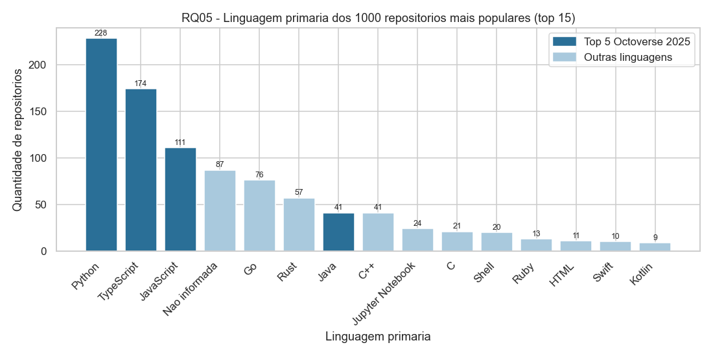
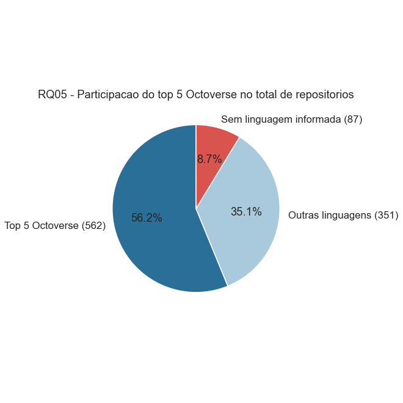
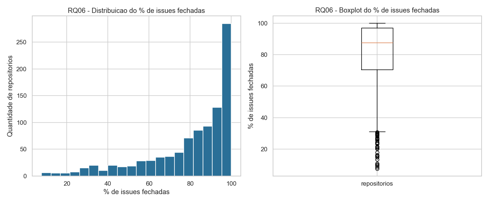
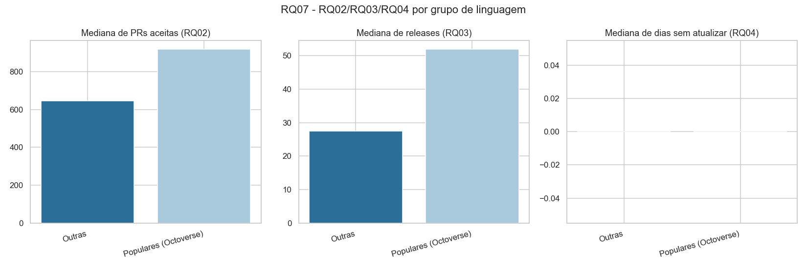
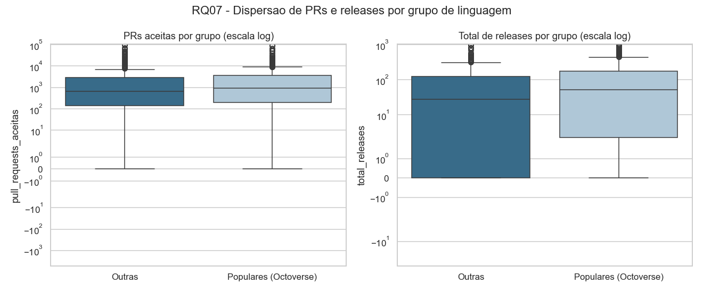
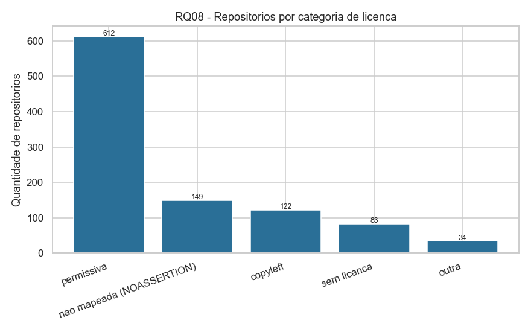
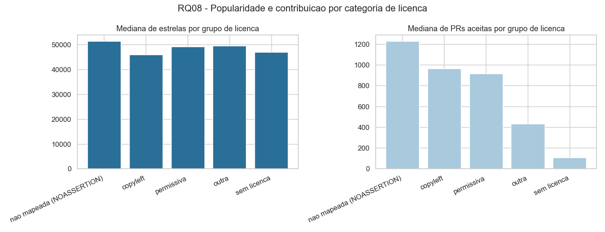

# Relatório — Laboratório 01: Características de repositórios populares

**Versão 2 (entrega da Lab01S03).** Traz a introdução com as hipóteses
informais, a metodologia de coleta, a configuração do processo e agora também
os resultados numéricos consolidados, os gráficos e a discussão hipótese vs.
resultado das 7 RQs do enunciado, mais as 2 propostas pelo grupo. Os gráficos
de RQ05–RQ08 são gerados por
[`notebooks/analise_rq05_rq08.ipynb`](notebooks/analise_rq05_rq08.ipynb) e
salvos em `notebooks/figuras/`.

- **Repositório:** https://github.com/gabrieltinoco/Laboratorio-Experimentacao-de-Software
- **GitHub Projects (v2):** https://github.com/users/gabrieltinoco/projects/2
- **Integrantes:** Arthur Miranda Pacher (`art1544`), Gabriel Lage Silva (`gabitolage`), Gabriel Lucas Tinoco de Aguiar (`gabrieltinoco`)

---

## 1. Introdução e hipóteses informais

O objeto de estudo são os 1.000 repositórios com maior número de estrelas no
GitHub. A pergunta de fundo é se "popular" implica um conjunto de características
de engenharia — maturidade, contribuição externa, cadência de release,
manutenção ativa, escolha de linguagem e disciplina no tratamento de issues.

A hipótese geral do grupo é que **estrela mede acervo, não atividade**: o
contador de estrelas é cumulativo e nunca decresce, então o top 1000 tende a
reunir tanto projetos vivos quanto projetos que foram muito populares no passado.
Se isso for verdade, cada RQ deve mostrar uma distribuição com cauda longa, e a
mediana — não a média — é o valor central a reportar.

Uma segunda hipótese, que atravessa várias RQs, é que o top 1000 **não é
composto só de software**. Listas "awesome", roteiros de estudo e coleções de
material didático são extremamente estreladas sem serem software distribuível, e
isso deve distorcer qualquer métrica que pressuponha um ciclo de
desenvolvimento (releases, pull requests, linguagem primária).

As hipóteses específicas por RQ, cada uma registrada na Issue do integrante
responsável:

| RQ | Métrica | Hipótese informal | Responsável / Issue |
|---|---|---|---|
| RQ01 | Idade do repositório | Repositórios populares tendem a ser maduros: esperamos que a maioria tenha pelo menos 5 anos, embora exista uma cauda de projetos novos. | `gabrieltinoco` — [#5](https://github.com/gabrieltinoco/Laboratorio-Experimentacao-de-Software/issues/5) |
| RQ02 | Total de pull requests aceitas | Repositórios populares tendem a receber muita contribuição externa: esperamos mediana alta de PRs aceitas e a maioria com pelo menos 500 PRs. | `gabrieltinoco` — [#6](https://github.com/gabrieltinoco/Laboratorio-Experimentacao-de-Software/issues/6) |
| RQ03 | Total de releases | Sistemas populares lançam releases com frequência | `art1544` — [#7](https://github.com/gabrieltinoco/Laboratorio-Experimentacao-de-Software/issues/7) |
| RQ04 | Tempo até a última atualização | Sistemas populares são atualizados com frequência | `art1544` — [#8](https://github.com/gabrieltinoco/Laboratorio-Experimentacao-de-Software/issues/8) |
| RQ05 | Linguagem primária | Repositórios populares concentram-se nas linguagens mais populares do mercado (top 5 do GitHub Octoverse 2025): esperamos que a maioria caia nessas 5 linguagens, com uma cauda longa de linguagens de nicho. | `gabitolage` — [#9](https://github.com/gabrieltinoco/Laboratorio-Experimentacao-de-Software/issues/9) |
| RQ06 | Razão issues fechadas / total | Repositórios populares mantêm um alto percentual de issues fechadas, reflexo de um processo de triagem ativo: esperamos mediana acima de 80% e poucos repositórios no extremo inferior. | `gabitolage` — [#10](https://github.com/gabrieltinoco/Laboratorio-Experimentacao-de-Software/issues/10) |
| RQ07 | RQ02, RQ03 e RQ04 por linguagem | Repositórios escritos nas linguagens mais populares recebem mais contribuição externa, lançam mais releases e são atualizados com mais frequência que os demais, pois um ecossistema maior atrai mais colaboradores e mais automação de CI/CD. | `gabitolage` — [#11](https://github.com/gabrieltinoco/Laboratorio-Experimentacao-de-Software/issues/11) |
| RQ08 (proposta pelo grupo) | Licença SPDX | Repositórios com licença permissiva (MIT, Apache-2.0, BSD...) recebem mais contribuição externa (mais PRs aceitas) que os com licença copyleft ou sem licença, porque a permissividade reduz a barreira legal para quem quer contribuir. | `gabitolage` — [#13](https://github.com/gabrieltinoco/Laboratorio-Experimentacao-de-Software/issues/13) |
| RQ09 (proposta pelo grupo) | Cadência de releases (releases por ano de vida) | A cadência se mantém ao longo da vida do projeto | `art1544` — [#18](https://github.com/gabrieltinoco/Laboratorio-Experimentacao-de-Software/issues/18) |

As RQ08 e RQ09 não estão no enunciado: são questões propostas pelo próprio
grupo, uma por integrante que as levantou, a partir do que a coleta permitiu
perguntar além das 7 originais.

### RQ03 — Sistemas populares lançam releases com frequência?

**Hipótese.** Um projeto com dezenas de milhares de estrelas tende a ser
consumido como dependência por terceiros, e quem é consumido como dependência
precisa de versionamento publicado. Esperamos, portanto, mediana de releases alta
e pouquíssimos repositórios sem nenhuma release.

### RQ04 — Sistemas populares são atualizados com frequência?

**Hipótese.** A visibilidade gera um fluxo constante de issues e pull requests, e
esse fluxo mantém o repositório em movimento. Esperamos tempo curto desde a
última atualização para praticamente todos os repositórios.

### RQ09 (proposta pelo grupo) — A cadência de releases se mantém ao longo da vida do projeto?

**Métrica.** Cadência de releases = `total_releases / idade em anos`, cruzada com
a idade do repositório (RQ01) e com o tempo desde o último push (RQ04).

**Por que perguntar isso.** A RQ03 mede o **total absoluto** de releases, e essa
métrica tem um viés estrutural: um repositório de 15 anos teve três vezes mais
tempo para publicar releases que um de 5 anos. Parte do resultado da RQ03 pode
ser, então, idade disfarçada de cadência. Normalizar pela idade testa se a
resposta da RQ03 sobrevive, e amarra três RQs que hoje são respondidas
isoladamente: idade (RQ01), releases (RQ03) e atividade (RQ04).

**Hipótese.** Esperamos duas coisas. Primeira: que o total de releases cresça com
a idade, porque projeto mais velho teve mais tempo de publicar. Segunda: que a
cadência, uma vez normalizada, seja aproximadamente estável entre projetos novos
e antigos, porque a prática de versionar releases seria uma característica do
projeto, não da época em que ele nasceu.

---

## 2. Metodologia de coleta

### 2.1 Fonte e recorte

Os dados vêm da **API GraphQL v4 do GitHub**, consultada por script próprio do
grupo (`Laboratorio01/src/fetch_repos.py`). Não é usada nenhuma biblioteca de
terceiros que consulte a API do GitHub: a query é escrita à mão e enviada por
requisição HTTP direta.

O recorte é a busca `stars:>1 sort:stars-desc` no tipo `REPOSITORY`, tomando os
**1.000 primeiros resultados** — que é também o teto de resultados que o endpoint
`search` devolve para uma mesma query.

### 2.2 Paginação

A busca é paginada por cursor, usando `pageInfo.hasNextPage` e
`pageInfo.endCursor` do próprio `search`, com o cursor da página anterior sendo
passado no argumento `after` da requisição seguinte. O laço para quando 1.000
repositórios foram coletados ou quando a API sinaliza que não há próxima página.
Respostas com erro 5xx são repetidas com espera progressiva.

### 2.3 Campos coletados

Uma única query traz todos os campos necessários a todas as RQs, para não haver
risco
de o mesmo repositório ser lido em momentos diferentes:

| Campo GraphQL | Coluna no CSV | RQ |
|---|---|---|
| `nameWithOwner` | `repositorio` | identificação |
| `stargazerCount` | `estrelas` | recorte e RQ08 |
| `createdAt` | `created_at` | RQ01, RQ09 |
| `pullRequests(states: MERGED).totalCount` | `pull_requests_aceitas` | RQ02, RQ07 |
| `releases.totalCount` | `total_releases` | RQ03, RQ07, RQ09 |
| `updatedAt` | `ultima_atualizacao`, `dias_desde_ultima_atualizacao` | RQ04, RQ07 |
| `pushedAt` | `ultimo_push`, `dias_desde_ultimo_push` | RQ04, RQ07 |
| `primaryLanguage.name` | `linguagem_primaria` | RQ05, RQ07 |
| `issues.totalCount` | `issues_total` | RQ06 |
| `issues(states: CLOSED).totalCount` | `issues_fechadas`, `percentual_issues_fechadas` | RQ06 |
| `licenseInfo.spdxId` | `licenca` | RQ08 |

As colunas derivadas (`dias_desde_*`, `percentual_issues_fechadas`) são
calculadas no momento da coleta, a partir dos campos brutos, e os campos brutos
são preservados no CSV para permitir recálculo e auditoria.

Saída: `Laboratorio01/data/repositorios_top1000.csv`, uma linha por repositório.

### 2.4 Definição de "linguagens mais populares" (RQ05 e RQ07)

A referência adotada é o **GitHub Octoverse 2025**, e é a mesma em todo o
laboratório: TypeScript, Python, JavaScript, Java e C#. A lista está fixada em
`src/validate_sample.py` (constante `LINGUAGENS_POPULARES`), para que a RQ05 e a
RQ07 usem exatamente o mesmo conjunto.

### 2.5 Validação dos dados

Cada integrante valida a sua parte das RQs em script próprio, verificando
consistência estrutural campo a campo, distribuição, outliers e valores
ausentes nos 1.000 repositórios:

| Script | Cobertura |
|---|---|
| `src/rq01_rq02.py` | RQ01, RQ02 |
| `src/validate_sample_rq03_rq04.py` | RQ03, RQ04 |
| `src/validate_sample.py` | RQ05, RQ06, RQ07, RQ08 |
| `src/rq09_cadencia_releases.py` | RQ09 |

### 2.6 Limitações conhecidas da coleta

- **`releases.totalCount` satura em 1.000.** 21 repositórios do top 1000 marcam
  exatamente 1.000 releases; nesses casos o valor é um limite inferior, não a
  contagem real.
- **`updatedAt` não mede atividade de código.** O campo sobe a cada estrela ou
  watch recebido. Nesta população ele fica saturado (detalhado na RQ04).
- **A coleta não é atômica.** As 1.000 linhas são lidas ao longo de várias
  requisições, então um repositório que recebe push durante a coleta pode ficar
  com contagem de dias negativa por questão de minutos. Ocorreu em 1 caso.
- **`pullRequests(states: MERGED)` conta PR aceita de qualquer autor**, inclusive
  de mantenedores. É uma aproximação de "contribuição externa", não a medida
  exata.

---

## 3. Resultados por RQ

> Valores consolidados e gráficos das 7 RQs do enunciado e das 2 propostas pelo
> grupo, calculados sobre os 1.000 repositórios validados na Lab01S02.

### RQ01 — Idade do repositório

Não foram encontrados valores ausentes ou inválidos em `created_at` (0/1000). A idade mediana foi de **7,75 anos**, com média de 7,67, mínimo de 0,02 e máximo de 18,36 anos. Em relação à distribuição, 323 repositórios (32,3%) têm menos de 5 anos, 331 (33,1%) têm entre 5 e 10 anos e 346 (34,6%) têm 10 anos ou mais. Ao todo, 677 (67,7%) têm pelo menos 5 anos.

Pelo critério de Tukey, usando 1,5 x IQR, Q1 = 3,52 e Q3 = 11,36 anos, não foram identificados outliers. O resultado apoia a hipótese informal de maturidade para a maioria, mas a presença de 323 repositórios com menos de 5 anos impede tratá-la como universal.

### RQ02 — Total de pull requests aceitas

Não foram encontrados valores ausentes ou inválidos em `pull_requests_aceitas` (0/1000). A mediana foi de **768 PRs aceitas**, com média de 4.237,1, mínimo de 0 e máximo de 103.354. A distribuição foi: 20 repositórios (2,0%) com 0 PR, 396 (39,6%) entre 1 e 499, 398 (39,8%) entre 500 e 4.999 e 186 (18,6%) com 5.000 ou mais. Ao todo, 584 (58,4%) têm pelo menos 500 PRs aceitas.

A distribuição é fortemente assimétrica à direita: Q1 = 175, Q3 = 3416 e IQR = 3241. Pelo critério de Tukey, os valores acima de 8277 são outliers; foram identificados 124 (12,4%), incluindo `firstcontributions/first-contributions`, `llvm/llvm-project`, `elastic/elasticsearch`, `getsentry/sentry` e `home-assistant/core`. Esses valores não devem ser removidos, mas a mediana deve ser priorizada na interpretação. A mediana alta e 58,4% acima do corte apoiam a hipótese informal, enquanto a cauda extrema explica por que a média não é representativa.

### RQ03 — Total de releases

Nenhuma inconsistência estrutural em 1.000 repositórios e nenhum valor ausente.

| Estatística | Valor |
|---|---|
| Mediana | 39 releases |
| Média | 126,6 |
| Q1 / Q3 | 0 / 147 |
| Mínimo / máximo | 0 / 1.000 |

Distribuição:

| Faixa | Repositórios |
|---|---|
| Nenhuma release | 286 (28,6%) |
| 1 a 10 releases | 76 (7,6%) |
| Acima de 100 releases | 343 (34,3%) |

A distribuição é **bimodal**: um bloco de 28,6% sem release nenhuma e um bloco de
34,3% acima de 100. Como Q1 = 0, a média de 126,6 não descreve nada e a mediana
de 39 é o único valor central defensável.

Os 21 repositórios travados em 1.000 releases (entre eles
`langchain-ai/langchain`, `vercel/next.js`, `electron/electron`) precisam ser
lidos como ">= 1000" na análise da S03.

### RQ04 — Tempo até a última atualização

Nenhuma inconsistência estrutural e nenhum valor ausente nas quatro colunas
envolvidas.

**A métrica literal do enunciado não discrimina nesta população.** Usando
`updatedAt`: mediana 0 dia, Q1 = Q3 = 0, amplitude total de 0 a 2 dias, com 984
dos 1.000 repositórios (98,4%) em 0 dia e 100% na faixa "até 7 dias". A causa é
conhecida: o `updatedAt` sobe a cada estrela ou watch, e os repositórios mais
estrelados do GitHub recebem estrelas continuamente.

**Métrica efetiva: `pushedAt`**, que só sobe com push de código.

| Faixa desde o último push | Repositórios |
|---|---|
| Até 7 dias | 616 (61,6%) |
| 8 a 30 dias | 111 (11,1%) |
| 31 a 90 dias | 64 (6,4%) |
| 91 a 365 dias | 94 (9,4%) |
| Mais de 365 dias | **115 (11,5%)** |

Mediana 2 dias, Q1 = 0, Q3 = 49, máximo 2.451 dias. Os mais parados são
`exacity/deeplearningbook-chinese` (2.451 dias), `GitSquared/edex-ui` (1.764),
`lib-pku/libpku` (1.687), `adobe/brackets` (1.529) e
`floodsung/Deep-Learning-Papers-Reading-Roadmap` (1.361).

### RQ05 — Linguagem primária

Nenhuma inconsistência estrutural nos 1.000 repositórios. `linguagem_primaria`
tem **44 valores distintos**, incluindo `Nao informada` para os casos em que a
API não retorna `primaryLanguage` (por exemplo, repositórios só com Markdown).

| Linguagem | Repositórios | % | Top 5 Octoverse |
|---|---:|---:|:---:|
| Python | 228 | 22,8% | * |
| TypeScript | 174 | 17,4% | * |
| JavaScript | 111 | 11,1% | * |
| Nao informada | 87 | 8,7% | |
| Go | 76 | 7,6% | |
| Rust | 57 | 5,7% | |
| C++ | 41 | 4,1% | |
| Java | 41 | 4,1% | * |
| Jupyter Notebook | 24 | 2,4% | |
| C | 21 | 2,1% | |
| C# | 8 | 0,8% | * |

As 5 linguagens do top 5 Octoverse 2025 somam **56,2%** dos 1.000 repositórios
(Python sozinho já é 22,8%). C#, apesar de estar no top 5 do Octoverse, aparece
em só 8 repositórios (0,8%) do top 1000 por estrelas — é uma linguagem
corporativa/empresarial, com forte presença em código fechado, o que não se
reflete no ranking de estrelas do GitHub. Há uma cauda longa relevante: **12
linguagens aparecem em um único repositório** (`Batchfile`, `Assembly`, `Blade`,
`Roff`, `Julia`, `Nunjucks`, `Svelte`, `Lua`, `LLVM`, `V`, `Elixir`,
`Objective-C`).

Os 87 repositórios (8,7%) sem `primaryLanguage` reforçam a segunda hipótese
geral do grupo: boa parte do top 1000 não é software tradicional (listas
"awesome", coleções de material, roteiros de estudo), então não tem uma
linguagem primária previsível pela API.

### RQ06 — Percentual de issues fechadas

Nenhuma inconsistência estrutural. 43 repositórios (4,3%) têm `issues_total =
0` e ficam sem `percentual_issues_fechadas` definido; os demais 957 formam a
base desta RQ.

| Estatística | Valor |
|---|---:|
| n | 957 |
| Mediana | 87,6% |
| Média | 80,3% |
| Q1 / Q3 | 70,5% / 96,8% |
| IQR | 26,3 pontos |
| Mínimo / máximo | 7,7% / 100,0% |

Distribuição por faixa:

| Faixa | Repositórios |
|---|---:|
| 0% a 25% | 22 (2,3%) |
| 25% a 50% | 86 (9,0%) |
| 50% a 75% | 175 (18,3%) |
| 75% a 99% | 649 (67,8%) |
| 100% | 28 (2,9%) |

A média (80,3%) fica abaixo da mediana (87,6%), sinal de **assimetria à
esquerda**: a maioria dos repositórios fecha quase todas as issues, e uma
minoria de valores baixos puxa a média para baixo. Pelo critério de Tukey (Q1 =
70,5, Q3 = 96,8, IQR = 26,3), o limite inferior é 31,0% — abaixo disso há **39
outliers (4,1%)**, todos no sentido inferior (o limite superior, 136,3%,
excede o teto de 100% da métrica, então não há outlier superior possível). Os
cinco valores mais baixos são `ComposioHQ/awesome-claude-skills` (7,7%),
`floodsung/Deep-Learning-Papers-Reading-Roadmap` (8,6%),
`anthropics/prompt-eng-interactive-tutorial` (9,5%), `elder-plinius/CL4R1T4S`
(10,1%) e `anthropics/financial-services` (10,2%) — repositórios de listas,
tutoriais e prompts, onde "issue" tende a significar pedido de conteúdo, não
bug a corrigir, e por isso se acumula sem ser fechada.

Não foi encontrado nenhum outlier em 0% (nenhum repositório com issues fecha
zero delas), mas **28 repositórios (2,9%) fecham 100%** das suas issues; os de
maior volume nessa faixa são `nodejs/node-v0.x-archive` (6.379 issues, projeto
arquivado — faz sentido estar 100% fechado), `localstack/localstack` (6.178),
`Homebrew/brew` (5.272), `nilbuild/developer-roadmap` (3.185) e
`filebrowser/filebrowser` (2.975).

### RQ07 — RQ02, RQ03 e RQ04 por linguagem

Repositórios foram divididos em dois grupos pela mesma regra da RQ05: **562
(56,2%)** em linguagem do top 5 Octoverse ("populares") e **438 (43,8%)** nas
demais ("outras").

| Grupo | n | Mediana PRs (RQ02) | Mediana releases (RQ03) | Sem releases | Mediana dias sem push (RQ04) |
|---|---:|---:|---:|---:|---:|
| Populares (Octoverse) | 562 | **920** | **52** | 21,5% | **1** |
| Outras | 438 | 646 | 28 | 37,7% | 4 |

Como a coluna `dias_desde_ultima_atualizacao` (`updatedAt`) está saturada em 0
para os dois grupos — a mesma limitação identificada na RQ04, porque
`updatedAt` sobe a cada estrela recebida —, a comparação de atividade usa
`dias_desde_ultimo_push` (`pushedAt`), coerente com a correção de método já
adotada na RQ04.

Nas três métricas o grupo de linguagens populares sai na frente: mediana de
PRs aceitas 42% maior (920 vs. 646), quase o dobro de releases (52 vs. 28),
menos da metade da proporção de repositórios sem nenhuma release (21,5% vs.
37,7%) e push mais recente (mediana de 1 dia vs. 4 dias). Os dois outliers já
identificados nas RQs anteriores caem em grupos diferentes: o máximo de PRs
aceitas, `firstcontributions/first-contributions` (103.354), está no grupo
"outras" (`linguagem_primaria` = `Nao informada`); o máximo de releases,
`langchain-ai/langchain` (1.000, no teto da API), está no grupo "populares"
(Python).

### RQ08 (proposta pelo grupo) — Licença e popularidade/contribuição

Nenhuma inconsistência estrutural. A coluna `licenca` tem **21 valores
distintos** (identificadores SPDX, `NOASSERTION` ou `Sem licenca`).

| Licença | Repositórios | % |
|---|---:|---:|
| MIT | 394 | 39,4% |
| Apache-2.0 | 181 | 18,1% |
| NOASSERTION | 149 | 14,9% |
| Sem licenca | 83 | 8,3% |
| GPL-3.0 | 50 | 5,0% |
| AGPL-3.0 | 48 | 4,8% |
| BSD-3-Clause | 21 | 2,1% |
| CC0-1.0 | 16 | 1,6% |
| GPL-2.0 | 12 | 1,2% |
| MPL-2.0 | 9 | 0,9% |

Agrupando pela classificação permissiva/copyleft de `validate_sample.py`
(`classificar_licenca`) e cruzando com a mediana de estrelas e de PRs aceitas
(mediana geral: 48.643 estrelas e 768 PRs aceitas):

| Grupo de licença | n | Mediana de estrelas | Mediana de PRs aceitas |
|---|---:|---:|---:|
| Não mapeada (NOASSERTION) | 149 | 51.375 | **1.228** |
| Permissiva | 612 | 49.107 | 914 |
| Copyleft | 122 | 45.974 | 963 |
| Outra | 34 | 49.437 | 431 |
| **Sem licença** | 83 | 47.009 | **108** |

A mediana de estrelas quase não varia entre grupos (45.974 a 51.375): licença
não parece influenciar quantas estrelas um repositório recebe. Já a mediana de
PRs aceitas varia muito mais: o grupo **sem licença** fica bem abaixo dos
demais (108 PRs, sétimo da mediana geral), enquanto o grupo **copyleft**
(963) fica levemente acima do **permissivo** (914) — na direção oposta à da
hipótese. O grupo `NOASSERTION` (licença que o GitHub não conseguiu
classificar automaticamente, geralmente por o texto de licença ser
não-padrão) tem a maior mediana de PRs aceitas (1.228) de todos.
**83 repositórios (8,3%) não têm licença nenhuma.**

### RQ09 (proposta pelo grupo) — Cadência de releases

Dos 1.000 repositórios, **714 (71,4%) têm cadência calculável**; os outros 286
não têm release nenhuma e, portanto, não têm cadência definida — o script trata
esse caso como ausência de versionamento, e não como cadência zero.

Cadência dos 714: mediana **14,88 releases/ano**, média 44,38, Q1 = 5,05,
Q3 = 38,88, mínimo 0,06, máximo 2.182.

**A idade não explica o total de releases.** Correlação de postos (Spearman,
calculada no próprio script, sem biblioteca externa):

| Par de variáveis | Correlação | n |
|---|---|---|
| Idade × total de releases | **+0,062** | 1.000 |
| Idade × cadência de releases | **−0,416** | 714 |

O limite de ruído para essa amostra é ±0,073, então o +0,062 é indistinguível de
zero: **repositório mais velho não tem mais releases**. Já o −0,416 é muito acima
do limite, e no sentido oposto ao esperado: **a cadência cai conforme o projeto
envelhece.**

O resultado sobrevive aos dois testes de robustez: excluindo os repositórios com
menos de 1 ano de vida, onde dividir por uma fração de ano infla a cadência, a
correlação vai a −0,348 (n = 656); excluindo também os 21 que estão no teto de
1.000 releases da API, vai a −0,353 (n = 635). Sinal e ordem de grandeza se
mantêm.

**Cadência por faixa de idade** — o resultado central da RQ09:

| Faixa de idade | n | Mediana de releases | Mediana de cadência |
|---|---|---|---|
| Até 3 anos | 136 | 40 | **43,85 rel/ano** |
| 3 a 7 anos | 188 | 108 | 23,92 rel/ano |
| 7 a 12 anos | 242 | 116 | 12,25 rel/ano |
| Mais de 12 anos | 149 | 98 | **6,76 rel/ano** |

O total de releases quase não varia entre as faixas (40, 108, 116, 98), mas a
cadência cai monotonicamente, por um fator de mais de 6 entre a faixa mais nova e
a mais velha.

**Cadência por grupo de atividade** (cruzamento com a RQ04):

| Grupo | n | Mediana de cadência | Idade mediana |
|---|---|---|---|
| Ativo (push ≤ 30 dias) | 591 | 18,19 rel/ano | 7,3 anos |
| Morno (31 a 365 dias) | 80 | 6,47 rel/ano | 9,0 anos |
| Parado (> 365 dias) | 43 | 4,05 rel/ano | 9,3 anos |

**Os 286 sem release.** Idade mediana de 8,2 anos, mediana de 42 dias sem push, e
**56,3% recebeu push nos últimos 90 dias**. Não são projetos mortos: são
repositórios mantidos que simplesmente não versionam releases — listas, roteiros
de estudo e coleções de material.

**Extremos.** No topo, `stablyai/orca` (2.182 rel/ano — 932 releases em 5 meses),
`ruvnet/ruflo` (822), `openai/codex` (736): todos projetos recentes, quase todos
de ferramental de IA. Na base, `moment/moment` (0,06 — uma release em 15,5 anos),
`DefinitelyTyped/DefinitelyTyped` (0,07) e `discourse/discourse` (0,07).

---

## 4. Discussão: hipótese vs. resultado

### RQ03 — parcialmente confirmada

Entre os repositórios que de fato são software distribuível, a hipótese se
sustenta com folga: 34,3% do top 1000 passa de 100 releases. Mas quase um terço
(28,6%) não publica release nenhuma, o que confirma a segunda hipótese geral do
grupo: "repositório popular no GitHub" e "software distribuível" não são a mesma
coisa. A conclusão de método é que a RQ03 deve ser reportada separando os dois
grupos, e não em um único número agregado.

### RQ04 — confirmada para a maioria, com uma correção de método

A hipótese se confirma para a maior parte da população: 61,6% recebeu push na
última semana. Mas 11,5% está sem push há mais de um ano, o que sustenta a
hipótese geral de que estrela é métrica de acervo. O caso mais eloquente é o
`adobe/brackets`, um editor oficialmente descontinuado que segue no top 1000 por
estrelas acumuladas.

A correção de método é que a métrica literal da RQ04 (`updatedAt`) tem de ser
substituída pelo `pushedAt` na análise da S03: reportar a mediana de 0 dia do
`updatedAt` como resposta da RQ04 seria reportar um artefato da API, e não uma
característica dos sistemas estudados.

### RQ05 — confirmada, com uma ressalva sobre o que "linguagem primária" mede

A hipótese se confirma: 56,2% do top 1000 está em uma das 5 linguagens do
Octoverse 2025, puxado principalmente por Python (22,8%) e TypeScript (17,4%).
Mas o resultado tem duas rachaduras. Primeira: C#, apesar de estar no top 5 do
Octoverse, é a linguagem menos representada do grupo (0,8%) — o índice do
Octoverse mede atividade em todo o GitHub, inclusive código fechado e
corporativo, enquanto o recorte deste laboratório é só o topo por estrelas,
um viés para projetos abertos e de maior visibilidade pública. Segunda: os
8,7% sem `primaryLanguage` reforçam a segunda hipótese geral do grupo — parte
do top 1000 não é software com uma linguagem dominante identificável.

### RQ06 — confirmada

A hipótese de alto percentual de issues fechadas se confirma com folga:
mediana de 87,6%, e 67,8% dos repositórios entre 75% e 99% fechadas. A
diferença entre mediana (87,6%) e média (80,3%) mostra que a cauda de baixo
percentual existe mas é pequena (39 outliers pelo critério de Tukey, 4,1%), e
concentrada num tipo específico de repositório: listas, tutoriais e prompts
(`ComposioHQ/awesome-claude-skills`,
`floodsung/Deep-Learning-Papers-Reading-Roadmap`), onde "issue" costuma ser
pedido de conteúdo em vez de defeito a corrigir, e por isso tende a se
acumular sem ser fechada. Isso é, de novo, a segunda hipótese geral do grupo
aparecendo: quando o resultado foge do esperado, é porque o repositório não é
software tradicional.

### RQ07 — confirmada nas três métricas

A hipótese se confirma de forma consistente: o grupo de linguagens populares
supera o grupo "outras" em PRs aceitos (920 vs. 646), em releases (52 vs. 28),
em proporção de repositórios sem nenhuma release (21,5% vs. 37,7%) e em
atividade recente medida por `pushedAt` (mediana de 1 dia vs. 4 dias sem
push). As quatro comparações apontam na mesma direção, o que dá mais
confiança ao resultado do que se fosse uma métrica isolada. Como já discutido
na RQ04, a comparação de atualização usou `dias_desde_ultimo_push`, não
`dias_desde_ultima_atualizacao` — a métrica literal do enunciado (`updatedAt`)
está saturada em 0 dia para os dois grupos e não discrimina nada nesta
população.

### RQ08 (proposta pelo grupo) — refutada entre permissiva e copyleft, confirmada só para ausência de licença

A hipótese original — permissiva > copyleft em contribuição externa — **não se
confirma**: a mediana de PRs aceitas do grupo copyleft (963) é levemente
*maior* que a do permissivo (914), o oposto do esperado. A licença não parece
ser, sozinha, uma barreira relevante à contribuição entre esses dois grupos
nesta população de repositórios já populares — o que sugere que, uma vez que
um projeto atinge visibilidade suficiente para entrar no top 1000, a escolha
entre um tipo de licença aberta e outro pesa menos do que outros fatores
(maturidade, presença de mantenedores ativos, documentação).

O achado mais forte da RQ08 apareceu em um lugar que a hipótese original não
previa: repositórios **sem nenhuma licença** têm mediana de PRs aceitas de
108 — cerca de 1/9 da mediana geral (768) e muito abaixo de todos os outros
grupos — apesar de ter mediana de estrelas (47.009) próxima da média geral
(48.643). Isso é consistente com a explicação legal: sem uma licença
explícita, o direito de copiar, modificar ou distribuir o código não está
concedido por padrão, o que desincentiva pull requests mesmo em projetos
muito estrelados. Estrela mede descoberta/interesse; PR aceita mede permissão
real de colaborar — e a licença separa essas duas coisas de um jeito que o
número de estrelas sozinho não mostra.

Um resultado secundário chama atenção: o grupo `NOASSERTION` (licença que o
GitHub não conseguiu classificar automaticamente a partir do texto) tem a
maior mediana de PRs aceitas de todos os grupos (1.228). Isso sugere que
projetos grandes e antigos o suficiente para ter um arquivo de licença
não-padrão (ou fora do formato que o GitHub reconhece) tendem a já ter uma
comunidade de contribuição estabelecida antes de a checagem automática de
licença existir — uma leitura que se soma à hipótese geral de que "popular no
GitHub" mistura eras diferentes de prática de engenharia, já discutida a
seguir na RQ09.

### RQ09 — as duas hipóteses refutadas, e uma métrica da RQ03 posta em dúvida

As duas partes da hipótese caíram.

A primeira parte — "o total de releases cresce com a idade" — foi refutada: a
correlação entre idade e total de releases é +0,062, indistinguível de zero para
essa amostra. Isso é, em si, um alívio metodológico: significa que o resultado da
RQ03 **não** é um artefato de repositórios velhos terem acumulado mais tempo.

A segunda parte — "a cadência é estável entre gerações" — foi refutada com força e
no sentido contrário: a cadência cai de 43,85 releases/ano nos projetos de até 3
anos para 6,76 nos de mais de 12, um fator de mais de 6, com correlação de −0,416
que resiste a dois cortes de robustez.

A explicação que os extremos sugerem é que **não estamos medindo cadência de
equipe, estamos medindo cadência de ferramenta**. Os projetos no topo
(`stablyai/orca`, `openai/codex`, `ruvnet/ruflo`) publicam release a cada merge,
por pipeline automatizado de integração contínua. Os da base (`moment/moment`,
`discourse/discourse`) são de uma época em que release era um evento manual, com
changelog escrito à mão. Ou seja: o que a RQ03 lê como "volume de releases" é, em
boa parte, **a prática de release da geração em que o projeto nasceu**.

A consequência prática para o laboratório é direta: **comparar o total de
releases de um projeto de 2013 com um de 2025 compara duas culturas de
engenharia, não dois níveis de atividade.** Na análise da S03, a RQ03 deve ser
reportada com a cadência ao lado do total, e qualquer comparação entre
repositórios de idades muito diferentes precisa dessa ressalva.

O cruzamento com a RQ04 acrescenta uma leitura no sentido inverso, e essa
confirmatória: quem está parado tem cadência histórica baixa (4,05 rel/ano contra
18,19 dos ativos). Cadência baixa e abandono andam juntos — o que sugere que a
cadência funciona como indicador de saúde do projeto, algo que nem a RQ03 nem a
RQ04 medem isoladamente.

---

## 5. Configuração do processo

O fluxo de trabalho no GitHub Projects (v2), com o critério de entrada e saída de
cada coluna, o limite de WIP e sua justificativa, e a rotina de snapshot, está
documentado em [`PROCESSO.md`](PROCESSO.md). Em resumo:

- **Colunas (campo Status):** `Backlog → To do → Doing → Review → Done`.
- **Limite de WIP em Doing:** 2 cartões por integrante, 6 no board com o trio
  completo. O número acompanha a divisão de duas RQs por integrante por sprint e
  a janela semanal de trabalho, e segue a sugestão das regras da disciplina.
- **Cartões = Issues** do repositório, sempre com Assignee. Não há draft issues.
- **Commits** referenciam o número da Issue correspondente.
- **Snapshots:** exportados por `src/export_project_snapshot.py` no fechamento de
  cada sprint e acumulados em `data/project_snapshots.csv`.

O print do board com o fluxo completo do Lab01 é anexado na entrega do relatório
final, conforme o enunciado.
