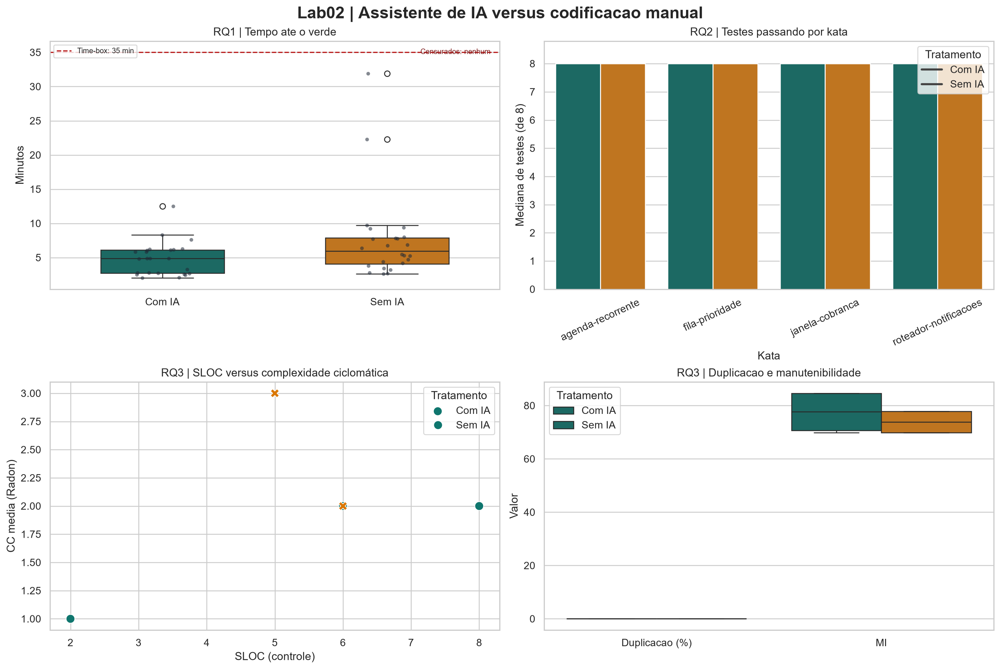
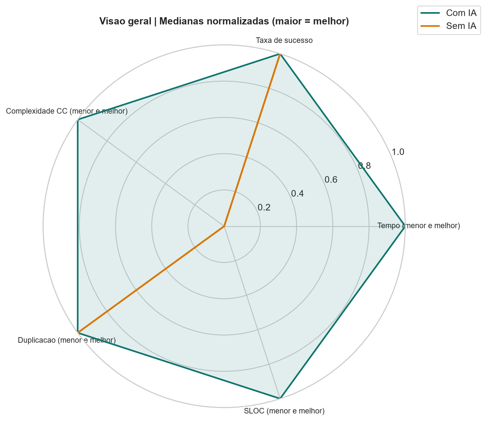

# Relatório Final — Assistentes de IA vs. Codificação Manual: um Experimento Controlado

- **Disciplina:** Laboratório de Experimentação de Software
- **Laboratório:** Lab02
- **Integrantes:** Gabriel L. Tinoco, Gabriel Lage
- **Repositório/GitHub Projects:** [Laboratorio-Experimentacao-de-Software](https://github.com/gabrieltinoco/Laboratorio-Experimentacao-de-Software)

---

## 1. Introdução

Assistentes de IA generativa, como GitHub Copilot, ChatGPT, Claude e Gemini, passaram a
fazer parte do dia a dia de quem desenvolve software. Eles completam trechos de código,
sugerem funções inteiras e respondem dúvidas sem que a pessoa saia do editor. A adoção
foi rápida, mas a evidência sobre o efeito real dessas ferramentas ainda é, em grande
parte, anedótica: relatos de ganho de produtividade convivem com relatos de código mais
longo, mais difícil de manter ou com defeitos sutis que passam despercebidos.

Este trabalho mede esse efeito com um **experimento controlado**. Os integrantes
resolveram tarefas de programação curtas (katas) de dificuldade equivalente, metade com
o GitHub Copilot ativo e metade com a extensão desativada. Linguagem (Python), IDE
(VS Code), testes de aceitação (pytest), time-box de 35 minutos por trial e ambiente
foram mantidos iguais nos dois tratamentos. O desenho é **crossover within-subject
contrabalanceado**. Cada integrante é o seu próprio controle, e a ordem de katas e
tratamentos alterna entre sequências para diluir o efeito de aprendizado.

As quatro katas (`fila-prioridade`, `janela-cobranca`, `agenda-recorrente` e
`roteador-notificacoes`) foram escritas pelo grupo para esta pesquisa. Cada uma pede a
implementação de uma única função e tem oito testes de aceitação. Katas clássicas e muito indexadas,
como FizzBuzz ou Bowling, foram evitadas de propósito. Com elas, o experimento mediria
a memória do participante ou do modelo, e não a ajuda do assistente na resolução.

O objetivo, na forma do GQM (Goal-Question-Metric), é:

> **Analisar** o uso de assistentes de IA generativa na resolução de tarefas de
> programação, **com o propósito de** comparar seu efeito frente à codificação manual,
> **com respeito a** tempo de resolução, qualidade funcional (defeitos) e qualidade
> estrutural do código produzido, **do ponto de vista** do grupo pesquisador, **no
> contexto de** katas de dificuldade equivalente resolvidos por estudantes de graduação
> sob condições controladas (crossover within-subject, time-boxed).

### 1.1 Questões de pesquisa

- **RQ1 — Tempo:** o uso de assistente de IA reduz o tempo necessário para resolver uma
  tarefa de programação?
- **RQ2 — Defeitos:** o uso de assistente de IA reduz a quantidade de defeitos (testes
  de aceitação que falham) no código produzido?
- **RQ3 — Estrutura:** o uso de assistente de IA altera a complexidade ciclomática, a
  duplicação ou o tamanho do código produzido?

### 1.2 Métricas escolhidas

| RQ | Métrica primária | Métricas complementares | Justificativa |
|---|---|---|---|
| RQ1 | Tempo até todos os testes passarem (*time-to-green*), em minutos | — | É o que se quer dizer por "resolver" a tarefa. Trials que não chegam ao verde são **censurados em 35 min** e continuam na análise, porque descartá-los favoreceria o tratamento com mais insucessos. |
| RQ2 | Nº de testes de aceitação falhando ao fim do trial | Taxa de sucesso (testes passando / total) | A contagem absoluta é comparável entre katas porque todas têm oito testes. A taxa deixa o resultado legível. |
| RQ3 | Complexidade ciclomática média por função (Radon `cc`) e % de linhas duplicadas (jscpd) | SLOC (**controle obrigatório**), complexidade por KLOC, Índice de Manutenibilidade (Radon `mi`) | Radon e jscpd são os equivalentes de CK e PMD CPD para Python. O SLOC acompanha as demais métricas porque código mais longo acumula mais complexidade sem ser, por função, mais complexo. |

Dado o N pequeno (quatro trials por integrante), as tabelas descritivas usam **mediana e
IQR** em vez de média e desvio-padrão.

---

## 2. Hipóteses

As hipóteses comparam o tratamento `com_ia` (Copilot ativo) ao tratamento `sem_ia`
(extensão desativada). Todas são avaliadas com o **teste de Wilcoxon signed-rank
pareado**, bilateral, com **α = 0,05**. Ele é não paramétrico e adequado ao desenho
within-subject e à amostra pequena, sem supor normalidade dos tempos, que costumam ter
cauda longa à direita.

A unidade de pareamento é o **integrante**. Cada um resolve cada kata uma única vez, em
um único tratamento, então o par comparado é a mediana dos trials com IA contra a
mediana dos trials sem IA da mesma pessoa. Assim, a diferença de habilidade entre
integrantes sai da comparação.

| RQ | Hipótese nula (H0) | Hipótese alternativa (H1) | Variável dependente |
|---|---|---|---|
| RQ1 | A distribuição do tempo até passar em todos os testes é igual entre os tratamentos. | O tempo até passar em todos os testes é **menor** com IA. | `tempo_ate_verde_min` |
| RQ2 | A distribuição do número de testes falhando ao fim do trial é igual entre os tratamentos. | O número de testes falhando é **menor** com IA. | `testes_falhando` e `taxa_sucesso` |
| RQ3 | As distribuições de complexidade, duplicação e LOC são iguais entre os tratamentos. | Pelo menos uma dessas métricas **difere** entre os tratamentos. | `cc_media`, `cc_total_por_kloc`, `dup_percentual`, `sloc` |

H1 é direcional em RQ1 e RQ2, porque a expectativa corrente é de que o assistente
acelere a resolução e reduza erros, e bilateral em RQ3, porque não há expectativa
firme de direção. O assistente pode tanto simplificar o código, sugerindo construções
idiomáticas, quanto inflá-lo, sugerindo trechos verbosos ou repetidos. Para manter o
critério uniforme, a decisão de rejeitar H0 usa sempre o p-valor bilateral. Nas RQ1 e
RQ2, o p unilateral é reportado como complemento.

Além do p-valor, cada teste reporta o **tamanho de efeito** (correlação rank-biserial
pareada, *r* ∈ [−1, 1]). Com poucos pares, um efeito relevante pode não atingir
significância, e um p-valor isolado não diz quão grande é a diferença.

### 2.1 Variáveis

| Papel | Variável | Níveis / unidade |
|---|---|---|
| Independente (fator) | Tratamento | `com_ia`, `sem_ia` |
| Independente controlada | Kata | `fila-prioridade`, `janela-cobranca`, `agenda-recorrente`, `roteador-notificacoes` |
| Dependente (RQ1) | Tempo até o verde | minutos (censura em 35) |
| Dependente (RQ2) | Testes falhando; taxa de sucesso | contagem; proporção |
| Dependente (RQ3) | Complexidade, duplicação, LOC, MI | CC por função; % de linhas; SLOC; índice 0–100 |
| Controle | Ambiente | Python, pytest, VS Code, Copilot, Radon e jscpd com versões fixadas ([`docs/ambiente.md`](ambiente.md)) |

---

## 3. Metodologia

O experimento foi executado em Python 3.10+, no Visual Studio Code, com pytest
como runner. O tratamento `com_ia` usou o GitHub Copilot ativo e o tratamento
`sem_ia` iniciou o VS Code com a extensão desabilitada. O time-box foi de 35
minutos por trial. Os snapshots disponíveis registram Windows 11, VS Code
1.137.0, Copilot 1.388.0, Radon 6.0.1 e jscpd 5.2.x; Python e pytest variam
entre as máquinas e ficam registrados em `data/ambiente.csv`.

Foram usadas quatro katas autorais: `fila-prioridade`, `janela-cobranca`,
`agenda-recorrente` e `roteador-notificacoes`. Cada kata possui oito testes de
aceitação e uma função pura, sem rede ou dependências externas. O desenho é
crossover within-subject: cada participante resolve duas katas com IA e duas
sem IA, com a ordem distribuída entre sequências contrabalanceadas.

Cada trial registra integrante, kata, tratamento, início/fim, tempo, status,
testes passando e comando executado. Trials sem sucesso seriam mantidos como
35 minutos censurados. Ao final, Radon calcula complexidade, SLOC e MI, enquanto
jscpd calcula duplicação. As análises priorizam mediana e IQR e usam Wilcoxon
pareado com alpha de 0,05.

---

## 4. Resultados

Os resultados detalhados estão em [`docs/analise_rq1_rq2.md`](analise_rq1_rq2.md)
e [`docs/analise_rq3.md`](analise_rq3.md). O dashboard reexecutável está em
[`src/dashboard.py`](../src/dashboard.py), e suas figuras estão em
[`graficos/dashboard_lab02.png`](../graficos/dashboard_lab02.png) e
[`graficos/dashboard_radar.png`](../graficos/dashboard_radar.png).

### 4.1 RQ1 — Tempo

Foram analisados 48 trials, 24 por tratamento, sem trials censurados. A mediana
do tempo foi 4,88 min com IA e 5,94 min sem IA; os IQRs foram 3,42 e 3,81 min,
respectivamente. O Wilcoxon pareado por integrante encontrou diferença mediana
de -1,81 min, p bilateral = 0,0342 e correlação rank-biserial r = -0,69.
Assim, H0 foi rejeitada: nesta amostra, o tratamento com IA reduziu o tempo até
o verde.

### 4.2 RQ2 — Defeitos

Todos os 48 trials terminaram com os oito testes passando. Portanto, a mediana
de testes falhando foi 0 e a taxa de sucesso foi 100% nos dois tratamentos. Não
houve diferenças pareadas não nulas, então o Wilcoxon não é aplicável e H0 não
é rejeitada. O gráfico por kata mostra esse teto comum de oito testes passando;
ele não deve ser interpretado como evidência de superioridade de um tratamento.

### 4.3 RQ3 — Estrutura do código

Há métricas estáticas para apenas oito trials, quatro por tratamento, formando
dois pares completos de integrantes. A mediana de `cc_media` foi 1,50 com IA e
2,50 sem IA; a de SLOC foi 4,00 e 5,50. A duplicação foi 0% nos dois grupos,
enquanto o MI mediano foi 77,76 e 73,89. Nenhuma hipótese foi rejeitada: para
as métricas com diferenças não nulas, o menor p bilateral possível com dois
pares foi 0,50. O resultado de RQ3 é, portanto, descritivo e limitado pela
ausência de código dos demais trials.

### 4.4 Dashboard de visualização

O painel 2x2 contém: boxplot de `tempo_ate_verde_min` com a linha de censura em
35 minutos; barras agrupadas da mediana de testes passando por kata; dispersão
de SLOC contra `cc_media`; e boxplots de duplicação e MI. O radar complementar
usa as medianas normalizadas de tempo, taxa de sucesso, complexidade, duplicação
e SLOC. Para manter a leitura consistente, as métricas em que menor é melhor
são invertidas, de modo que valores mais externos representam um perfil melhor.

*Figura 1 — Dashboard comparativo de tempo, testes passando, complexidade,
duplicação e índice de manutenibilidade.*

*Figura 2 — Radar holístico: valores mais externos representam melhor perfil;
métricas em que menor é melhor foram invertidas.*

---

## 5. Discussão

O principal sinal observado foi de produtividade: o tempo mediano foi menor com
IA e o efeito foi grande no pareamento disponível. Isso responde RQ1 de forma
favorável ao Copilot, mas não permite atribuir o ganho exclusivamente à
ferramenta sem considerar ordem, familiaridade e diferenças de execução.

Para RQ2, o efeito não pôde ser observado porque houve efeito-teto: todos os
participantes passaram em todos os testes nos dois tratamentos. Isso mostra boa
qualidade funcional dos resultados coletados, mas não compara capacidade de
evitar defeitos em tarefas mais difíceis.

Em RQ3, os valores sugerem menor complexidade média e menor SLOC com IA, porém a
amostra estrutural cobre somente dois integrantes. A duplicação zero em todos os
casos também impede qualquer contraste. A principal limitação é a cobertura
incompleta de métricas estáticas; outra é o N pequeno, que reduz o poder do
Wilcoxon. Permanecem ameaças de aprendizado, fadiga, experiência prévia com
Copilot, variação de máquina/versão e impossibilidade de cegamento. O
contrabalanceamento, o time-box fixo, as katas autorais, o registro de logs e o
pareamento within-subject mitigam parte desses riscos.

---

## 6. Conclusão

Com os dados disponíveis, o uso do GitHub Copilot esteve associado a menor tempo
até o verde, com diferença estatisticamente significativa no teste pareado. Não
houve diferença observável em defeitos porque todos os trials passaram nos oito
testes. As métricas estruturais apontam diferenças descritivas, especialmente
em complexidade e SLOC, mas a cobertura reduzida de RQ3 impede uma conclusão
inferencial. A continuação recomendada é medir os códigos finais dos 40 trials
restantes e repetir o dashboard e os testes estatísticos antes de generalizar
os resultados.
